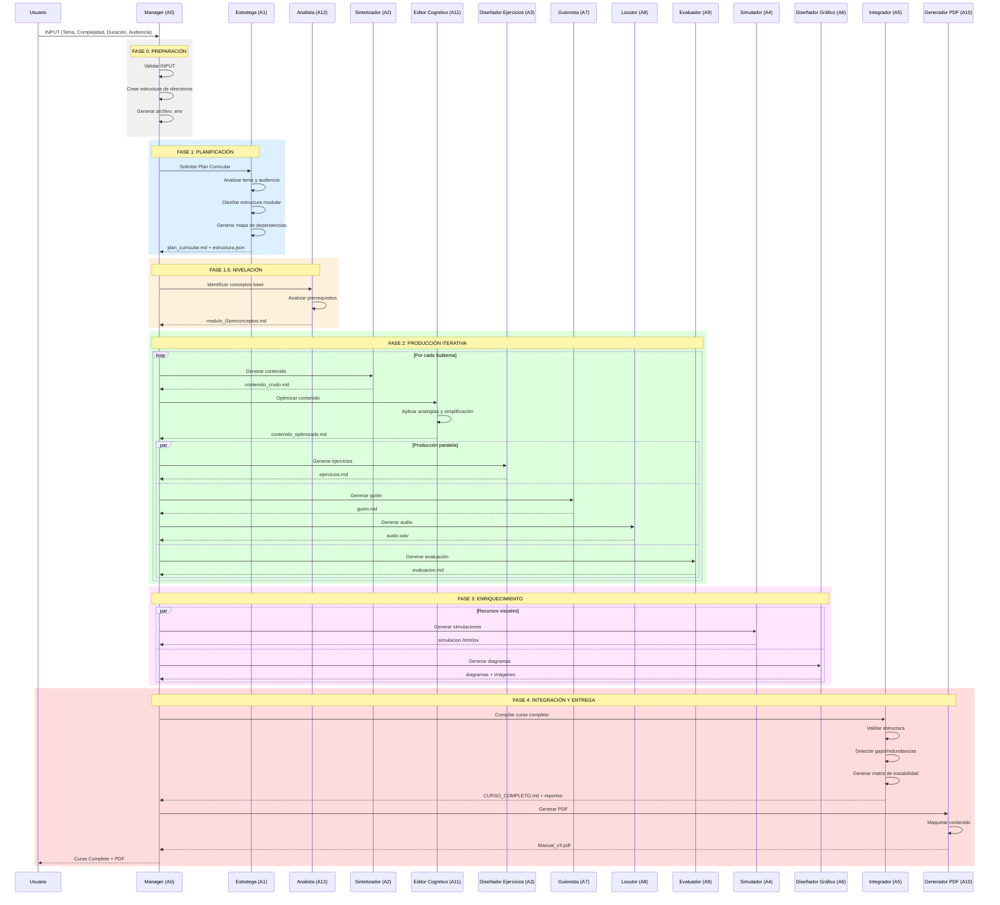
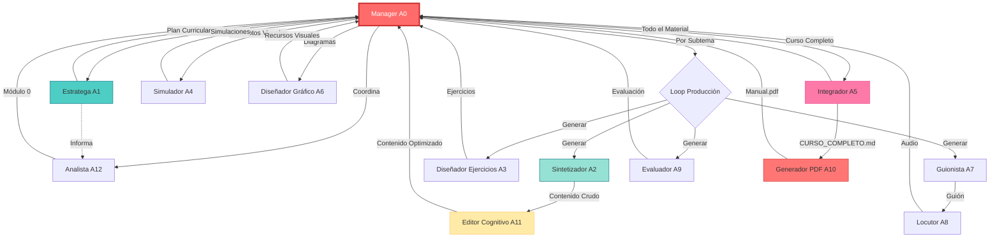
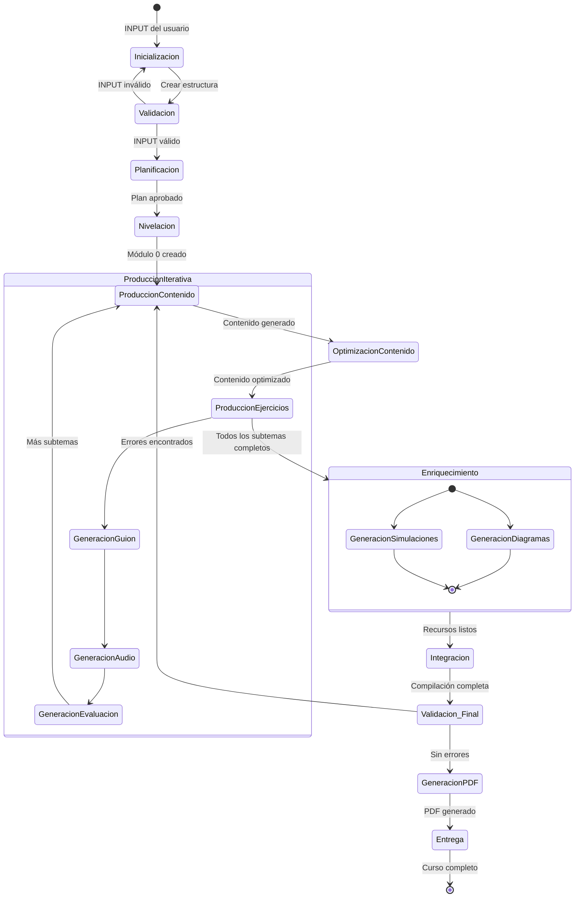

# SISTEMA DE AGENTES PARA CREACIÓN DE CURSOS TÉCNICOS

Sistema multi-agente orquestado que genera cursos técnicos y científicos de complejidad media-alta con aprendizaje adaptativo. El sistema cuenta con 13 agentes especializados coordinados por un agente manager que gestiona el flujo completo de producción.

## 🏗️ ARQUITECTURA DEL SISTEMA

### Visión General

```mermaid
graph TB
    User((Usuario)) -->|Parámetros del Curso| Manager[🎯 AGENTE 0: MANAGER]
    
    subgraph "FASE 0: Preparación"
        Manager -->|Validar Input| Config[Configuración .env]
        Manager -->|Crear Estructura| Dirs[Directorios del Curso]
    end
    
    subgraph "FASE 1: Planificación"
        Manager -->|Solicitar Plan| A1[📋 AGENTE 1: Estratega]
        A1 -->|Plan Curricular + JSON| Manager
    end
    
    subgraph "FASE 1.5: Nivelación"
        Manager -->|Identificar Conceptos Base| A12[🔍 AGENTE 12: Analista]
        A12 -->|Módulo 0 Preconceptos| Manager
    end
    
    subgraph "FASE 2: Producción Iterativa"
        Manager -->|Por cada Subtema| Loop{Iterar}
        Loop -->|Generar Contenido| A2[📝 AGENTE 2: Sintetizador]
        A2 -->|Contenido Crudo| A11[🧠 AGENTE 11: Editor Cognitivo]
        A11 -->|Contenido Optimizado| Manager
        
        Loop -->|Generar Ejercicios| A3[💪 AGENTE 3: Diseñador Ejercicios]
        Loop -->|Generar Guión| A7[🎬 AGENTE 7: Guionista]
        A7 -->|Script| A8[🎙️ AGENTE 8: Locutor]
        Loop -->|Generar Evaluación| A9[📊 AGENTE 9: Evaluador]
        
        A3 --> Manager
        A8 --> Manager
        A9 --> Manager
    end
    
    subgraph "FASE 3: Enriquecimiento"
        Manager -->|Conceptos Visuales| A4[🎮 AGENTE 4: Simulador]
        Manager -->|Diagramas e Imágenes| A6[🎨 AGENTE 6: Diseñador Gráfico]
        A4 --> Manager
        A6 --> Manager
    end
    
    subgraph "FASE 4: Integración y Entrega"
        Manager -->|Compilar Todo| A5[🔧 AGENTE 5: Integrador]
        A5 -->|CURSO_COMPLETO.md| Manager
        Manager -->|Generar PDF| A10[📄 AGENTE 10: Generador PDF]
        A10 -->|Manual_vX.pdf| User
    end
    
    style Manager fill:#ff6b6b,stroke:#c92a2a,stroke-width:3px,color:#fff
    style A1 fill:#4ecdc4,stroke:#0b7285
    style A2 fill:#95e1d3,stroke:#0b7285
    style A3 fill:#f9ca24,stroke:#f39c12
    style A4 fill:#6c5ce7,stroke:#5f3dc4,color:#fff
    style A5 fill:#fd79a8,stroke:#e84393
    style A6 fill:#74b9ff,stroke:#0984e3
    style A7 fill:#a29bfe,stroke:#6c5ce7
    style A8 fill:#fdcb6e,stroke:#e17055
    style A9 fill:#55efc4,stroke:#00b894
    style A10 fill:#ff7675,stroke:#d63031
    style A11 fill:#ffeaa7,stroke:#fdcb6e
    style A12 fill:#dfe6e9,stroke:#636e72
```



## 🤖 CATÁLOGO DE AGENTES

### Agente 0: Manager del Curso 🎯
**Rol**: Director de Producción Educativa  
**Responsabilidad**: Orquestador principal del sistema
**Funciones**:
- Validar y configurar parámetros del curso
- Crear estructura de directorios
- Coordinar llamadas secuenciales a agentes especializados
- Gestionar flujo de trabajo completo
- Generar reportes de progreso

**Inputs**: Parámetros del curso (tema, complejidad, duración, audiencia)  
**Outputs**: Curso completo organizado y archivos de configuración

---

### Agente 1: Estratega Curricular 📋
**Responsabilidad**: Arquitectura del curso

**Funciones**:
- Análisis del tema y audiencia
- Diseño de arquitectura curricular completa
- Creación de 3 rutas de aprendizaje (Básica/Intermedia/Avanzada)
- Generación de mapa de dependencias conceptuales
- Definición de objetivos por módulo
- Estimación temporal realista

**Inputs**: Tema, audiencia, complejidad, duración  
**Outputs**: 
- `plan_curricular.md` (2000-3000 palabras)
- `estructura_curso.json` (estructura parseable)
- `mapa_dependencias.mermaid` (diagrama)

---

### Agente 2: Sintetizador de Contenido 📝
**Responsabilidad**: Generación de contenido teórico-práctico

**Funciones**:
- Redacción de material denso y técnico
- Progresión pedagógica: Intuitivo → Formal → Aplicado
- Generación de código ejecutable con tests
- Inclusión de casos de uso reales
- Adaptación por nivel de ruta

**Inputs**: Título del módulo, objetivos, nivel de ruta  
**Outputs**: `modulo_X/tema_Y_subtema_Z_contenido.md` (2500-3000 palabras)

**Estructura del Contenido**:
1. Contexto y motivación
2. Fundamentos teóricos
3. Implementación práctica
4. Código ejecutable
5. Casos de uso
6. Comparación con alternativas
7. Mejores prácticas
8. Errores comunes
9. Recursos adicionales
10. Resumen ejecutivo
11. Puntos clave

---

### Agente 3: Diseñador de Ejercicios 💪
**Responsabilidad**: Creación de ejercicios y evaluaciones

**Funciones**:
- Banco de ejercicios graduados (⭐ → ⭐⭐⭐⭐)
- Casos de prueba en 3 niveles
- Soluciones modelo completas
- Rúbricas técnicas objetivas
- Diagnóstico de errores comunes

**Inputs**: Contenido del módulo  
**Outputs**: `modulo_X/tema_Y_subtema_Z_ejercicios.md` (3000-4000 palabras)

**Tipos de Ejercicios**:
- Conceptuales (comprensión)
- Prácticos (implementación)
- Desafíos (optimización/creatividad)
- Proyectos integradores

---

### Agente 4: Generador de Simulaciones 🎮
**Responsabilidad**: Visualizaciones interactivas

**Funciones**:
- Programación de artifacts React/HTML
- Visualizaciones de algoritmos y conceptos
- Controles interactivos (Play/Pause/Step/Reset)
- Feedback inmediato
- Métricas en tiempo real

**Inputs**: Concepto técnico a visualizar  
**Outputs**: Archivos `.html` o `.jsx` en `simulaciones/`

**Características**:
- 100% funcional y autocontenido
- Responsive design
- Documentación inline
- Configuración paramétrica

---

### Agente 5: Integrador y Control de Calidad 🔧
**Responsabilidad**: Ensamblaje y validación

**Funciones**:
- Compilación de todos los componentes
- Validación estructural/técnica/pedagógica
- Detección de gaps y redundancias
- Generación de matriz de trazabilidad
- Creación de menú de navegación
- Generación de guías (estudiante/instructor)

**Inputs**: Todos los archivos del curso  
**Outputs**: 
- `CURSO_COMPLETO.md` (15k-20k palabras)
- `MENU.md` (navegación)
- `REPORTE_VALIDACION.md`
- `MATRIZ_TRAZABILIDAD.csv`

**Validaciones Automáticas**:
- ✅ Grafo de dependencias acíclico
- ✅ Completitud de módulos
- ✅ Duración dentro de rango (±15%)
- ✅ Código ejecutable sin errores
- ✅ Terminología estandarizada
- ✅ Trazabilidad 100%
- ✅ Progresión de dificultad validada

---

### Agente 6: Diseñador Gráfico 🎨
**Responsabilidad**: Recursos visuales

**Funciones**:
- Generación de diagramas Mermaid
- Prompts para DALL-E/Stable Diffusion
- Ilustraciones técnicas
- Infografías
- Esquemas de arquitectura

**Inputs**: Contenido del módulo  
**Outputs**: 
- Imágenes en `media/`
- Diagramas insertados en contenido
- `prompts_visuales.md`

---

### Agente 7: Guionista 🎬
**Responsabilidad**: Guiones para audio/video

**Funciones**:
- Adaptación de contenido técnico a narrativa
- Estructura de guión profesional
- Marcación de tiempos
- Indicaciones de tono y ritmo
- Optimización para locución

**Inputs**: Contenido del módulo  
**Outputs**: `modulos/modulo_X/tema_Y_subtema_Z_guion.md`

**Formato del Guión**:
- Ficha técnica (duración, tono)
- Timestamps
- Texto del locutor
- Indicaciones técnicas
- Efectos y música (sugerencias)

---

### Agente 8: Locutor (Audio Generator) 🎙️
**Responsabilidad**: Síntesis de voz

**Funciones**:
- Conversión de guiones a audio
- Uso de síntesis de voz (TTS)
- Generación de archivos WAV
- Configuración de voz y parámetros
- Inserción de reproductores en contenido

**Inputs**: Guiones de texto  
**Outputs**: 
- Archivos `.wav` en `media/`
- Reproductores HTML embebidos

**Tecnología**:
- PowerShell con System.Speech (Windows)
- Voces configurables (Microsoft Sabina/Salome)
- Script automatizado: `generate_all_audios.ps1`

---

### Agente 9: Evaluador 📊
**Responsabilidad**: Evaluaciones y solucionarios

**Funciones**:
- Bancos de preguntas por módulo
- Respuestas con rationale explicado
- Alineación pedagógica con objetivos
- Graduación de dificultad
- Retroalimentación formativa

**Inputs**: Contenido del módulo  
**Outputs**: 
- `modulo_X/tema_Y_subtema_Z_evaluacion.md`
- Incluye preguntas y solucionario

**Tipos de Preguntas**:
- Opción múltiple
- Verdadero/Falso con justificación
- Código para completar
- Debugging
- Análisis de casos

---

### Agente 10: Generador PDF 📄
**Responsabilidad**: Maquetación profesional

**Funciones**:
- Conversión Markdown → PDF
- Inserción de tabla de contenidos
- Paginación correcta
- Estilos consistentes
- Numeración automática
- Inclusión de portada y metadatos

**Inputs**: `CURSO_COMPLETO.md`  
**Outputs**: `Manual_Profesional_vX.pdf`

**Tecnología**:
- Node.js con markdown-pdf o Paged.js
- HTML/CSS para estilos
- Script: `generate_pdf.js`

---

### Agente 11: Editor Cognitivo 🧠
**Responsabilidad**: Optimización cognitiva del contenido

**Funciones**:
- Aplicación de analogías efectivas
- Simplificación sin pérdida de rigor
- Mejora de ejemplos
- Optimización de secuencia de conceptos
- Técnicas de retención (chunking, spacing)

**Inputs**: Contenido crudo del Agente 2  
**Outputs**: Contenido optimizado (reemplaza original)

**Técnicas Aplicadas**:
- Analogías del mundo real
- Progresión de complejidad gradual
- Ejemplos concretos antes que abstractos
- Repetición espaciada de conceptos clave

---

### Agente 12: Analista de Preconceptos 🔍
**Responsabilidad**: Nivelación de audiencia

**Funciones**:
- Identificación de conceptos fundamentales
- Creación del Módulo 0 (Prerrequisitos)
- Glosario jerárquico
- Explicaciones de conceptos base
- Diagnóstico de conocimientos previos

**Inputs**: Plan curricular  
**Outputs**: `modulo_0/tema_0.1_preconceptos.md`

**Contenido del Módulo 0**:
- Conceptos transversales
- Definiciones clave
- Relaciones entre conceptos
- Autoevaluación diagnóstica

---

## 🔄 WORKFLOWS Y SECUENCIAS DE INTERACCIÓN

### Flujo de Trabajo Principal

El Agente 0 (Manager) coordina todo el proceso siguiendo esta secuencia:



---

### Diagrama de Dependencias entre Agentes



---

### Tabla de Interacciones entre Agentes

| Agente Origen | Agente Destino | Tipo de Interacción | Datos Transferidos | Frecuencia |
|---------------|----------------|---------------------|-------------------|------------|
| Manager (A0) | Estratega (A1) | Solicitud | Parámetros del curso | 1x por curso |
| Estratega (A1) | Manager (A0) | Respuesta | Plan curricular + JSON | 1x por curso |
| Manager (A0) | Analista (A12) | Solicitud | Plan curricular | 1x por curso |
| Analista (A12) | Manager (A0) | Respuesta | Módulo 0 de preconceptos | 1x por curso |
| Manager (A0) | Sintetizador (A2) | Solicitud | Objetivos del subtema | N veces (por subtema) |
| Sintetizador (A2) | Manager (A0) | Respuesta | Contenido crudo | N veces |
| Manager (A0) | Editor Cognitivo (A11) | Solicitud | Contenido crudo | N veces |
| Editor Cognitivo (A11) | Manager (A0) | Respuesta | Contenido optimizado | N veces |
| Manager (A0) | Diseñador Ejercicios (A3) | Solicitud | Contenido del subtema | N veces |
| Diseñador Ejercicios (A3) | Manager (A0) | Respuesta | Banco de ejercicios | N veces |
| Manager (A0) | Guionista (A7) | Solicitud | Contenido del subtema | N veces |
| Guionista (A7) | Manager (A0) | Respuesta | Guión narrativo | N veces |
| Manager (A0) | Locutor (A8) | Solicitud | Guión | N veces |
| Locutor (A8) | Manager (A0) | Respuesta | Archivo de audio WAV | N veces |
| Manager (A0) | Evaluador (A9) | Solicitud | Contenido del subtema | N veces |
| Evaluador (A9) | Manager (A0) | Respuesta | Evaluación + solucionario | N veces |
| Manager (A0) | Simulador (A4) | Solicitud | Concepto a visualizar | M veces (por visualización) |
| Simulador (A4) | Manager (A0) | Respuesta | Artifact interactivo | M veces |
| Manager (A0) | Diseñador Gráfico (A6) | Solicitud | Contenido a ilustrar | K veces (por recurso visual) |
| Diseñador Gráfico (A6) | Manager (A0) | Respuesta | Diagramas e imágenes | K veces |
| Manager (A0) | Integrador (A5) | Solicitud | Todos los archivos | 1x por curso |
| Integrador (A5) | Manager (A0) | Respuesta | Curso compilado + reportes | 1x por curso |
| Manager (A0) | Generador PDF (A10) | Solicitud | CURSO_COMPLETO.md | 1x por curso |
| Generador PDF (A10) | Manager (A0) | Respuesta | Manual en PDF | 1x por curso |

---

### Estados del Sistema



---

### 🚀 Generación de Curso Completo (Agente 0)

El **Agente 0 (Manager)** es el orquestador principal. Su función es coordinar a todos los demás agentes para producir un curso completo desde cero.

**Comando:**

```bash
/0-manager-curso
```

**Flujo de Trabajo Automático:**

1. **Planificación**: Llama al Agente 1 para crear el Plan Curricular.
2. **Producción**: Itera por cada módulo llamando a los Agentes 2 (Contenido) y 3 (Ejercicios).
3. **Enriquecimiento**:
    - Agente 4: Genera simulaciones interactivas.
    - Agente 6: Crea recursos gráficos y diagramas.
    - Agente 7: Escribe guiones de video/audio.
    - Agente 8: Genera archivos de audio (TTS).
    - Agente 9: Crea evaluaciones y solucionarios.
    - Agente 11: Optimiza cognitivamente el contenido (analogías).
4. **Integración y Entrega**:
    - Agente 5: Ensambla el `CURSO_COMPLETO.md`.
    - Agente 10: Genera el PDF final.

---

### 🛠️ Uso Individual de Agentes

Puedes invocar a cada agente por separado para tareas específicas o para regenerar partes de un curso.

#### 1. Estratega Curricular

**Comando**: `/1-estratega-curricular`
**Función**: Diseña la arquitectura del curso, mapa de dependencias y rutas de aprendizaje.
**Input**: Tema, Audiencia, Complejidad.
**Output**: `plan_curricular.md`

#### 2. Sintetizador de Contenido

**Comando**: `/2-sintetizador-contenido`
**Función**: Redacta el contenido teórico y práctico de un módulo específico.
**Input**: Título del módulo, Objetivos.
**Output**: `modulo_X_contenido.md`

#### 3. Diseñador de Ejercicios

**Comando**: `/3-disenador-ejercicios`
**Función**: Crea ejercicios, retos y rúbricas de evaluación.
**Input**: Contenido del módulo.
**Output**: `modulo_X_ejercicios.md`

#### 4. Generador de Simulaciones

**Comando**: `/4-generador-simulaciones`
**Función**: Programa visualizaciones interactivas en React/HTML.
**Input**: Concepto técnico a visualizar.
**Output**: Archivos `.html` o `.jsx` en `simulaciones/`.

#### 5. Integrador de Calidad

**Comando**: `/5-integrador-calidad`
**Función**: Ensambla el curso, genera el menú de navegación y valida la coherencia.
**Input**: Todos los archivos del curso.
**Output**: `CURSO_COMPLETO.md`, `MENU.md`.

#### 6. Diseñador Gráfico

**Comando**: `/6-disenador-grafico`
**Función**: Genera diagramas (Mermaid) e ilustraciones (DALL-E/Stable Diffusion) para enriquecer el contenido.
**Input**: Contenido del módulo.
**Output**: Imágenes en `media/` e inserción en `modulo_X_contenido.md`.

#### 7. Guionista

**Comando**: `/7-guionista`
**Función**: Adapta el contenido técnico a guiones narrativos para audio/video.
**Input**: Contenido del módulo.
**Output**: `guiones/modulo_X_guion.md`

#### 8. Locutor (Audio Generator)

**Comando**: `/8-locutor`
**Función**: Convierte los guiones en archivos de audio `.wav` usando síntesis de voz.
**Input**: Guiones de texto.
**Output**: Archivos de audio en `media/` e inserción de reproductores en el contenido.

#### 9. Evaluador

**Comando**: `/9-evaluador`
**Función**: Genera bancos de preguntas y respuestas explicadas (Rationale) alineadas pedagógicamente.
**Input**: Contenido del módulo.
**Output**: `modulo_X_preguntas.md` y `modulo_X_respuestas.md`.

#### 10. Generador PDF

**Comando**: `/10-generador-pdf`
**Función**: Convierte el curso completo a un PDF profesional.
**Input**: `CURSO_COMPLETO.md`.
**Output**: `Manual_Profesional.pdf`.

#### 11. Editor Cognitivo

**Comando**: `/11-editor-cognitivo`
**Función**: Optimiza explicaciones técnicas usando analogías y simplificación.
**Input**: Módulo crudo.
**Output**: Módulo optimizado.

#### 12. Analista de Preconceptos

**Comando**: `/12-analista-preconceptos`
**Función**: Identifica conceptos base y genera el Módulo 0.
**Input**: Plan Curricular.
**Output**: `tema_0.1_preconceptos.md`.

## 📚 DOCUMENTACIÓN ADICIONAL

- **[ARQUITECTURA.md](./docs/ARQUITECTURA.md)**: Diagramas de arquitectura, componentes, capas, patrones de diseño y modelo de datos
- **[WORKFLOWS.md](./docs/WORKFLOWS.md)**: Documentación detallada de workflows, flujos de interacción, protocolos de comunicación y manejo de errores
- **[EJEMPLOS_INTERACCIONES.md](./docs/EJEMPLOS_INTERACCIONES.md)**: Ejemplo completo paso a paso de la generación del Curso DevOps Avanzado con diagramas de secuencia, cronología y estadísticas reales
- **[.agent/workflows/](`./.agent/workflows/)**: Especificaciones individuales de cada agente

---

## 🔧 SCRIPTS DE AUTOMATIZACIÓN

### Script de Generación de Audio

**Archivo**: `generate_all_audios.ps1`  
**Propósito**: Conversión masiva de guiones a audio WAV

**Uso**:
```powershell
# Procesar todo el curso
.\generate_all_audios.ps1 -BaseDirectory "e:\repositories\teach-laoz-courses-generator\curso_devops_avanzado"

# Especificar directorio de salida
.\generate_all_audios.ps1 -BaseDirectory ".\cursos\mi_curso" -OutputDirectory ".\audio_output"

# Usar voz diferente
.\generate_all_audios.ps1 -BaseDirectory ".\cursos\mi_curso" -VoiceName "Microsoft Helena Desktop"
```

**Características**:
- ✅ Búsqueda recursiva de archivos `*_guion.md`
- ✅ Extracción automática del texto del locutor
- ✅ Soporte para 3 formatos de guión diferentes
- ✅ Configuración de voz personalizable
- ✅ Generación de nombres de archivo automática
- ✅ Reportes de progreso y estadísticas

**Voces disponibles** (Windows):
- `Microsoft Sabina Desktop` (Español España)
- `Microsoft Salome Desktop - Spanish (Colombia)` (Español Colombia - **predeterminada**)
- `Microsoft Helena Desktop` (Español España)

---

### Script de Generación de PDF

**Archivo**: `scripts/generate_pdf.js`  
**Propósito**: Convertir curso completo a PDF profesional

**Uso**:
```bash
node scripts/generate_pdf.js cursos/curso_devops_avanzado/CURSO_COMPLETO.md
```

**Características**:
- ✅ Conversión Markdown → PDF
- ✅ Tabla de contenidos automática
- ✅ Estilos profesionales
- ✅ Numeración de páginas
- ✅ Portada personalizada

---

## 💡 PERSONALIZACIÓN

### Fortalezas

**Agente 1: Estratega**

- Mapa conceptual con dependencias (Mermaid)
- 3 rutas diferenciadas desde diseño
- Estimación temporal realista (factor 1.5)
- Matriz de trazabilidad

**Agente 2: Contenido**

- Estructura 11 secciones (intuitivo→formal→aplicado)
- Código 100% ejecutable con tests
- Adaptación automática por nivel
- Comparación con alternativas técnicas

**Agente 3: Ejercicios**

- Graduación por dificultad (⭐→⭐⭐⭐⭐)
- Rúbricas objetivas (% por criterio)
- Casos de prueba en 3 niveles
- Diagnóstico de errores con causa raíz

**Agente 4: Simulaciones**

- Artifacts interactivos React/HTML
- Controles estándar (Play/Pause/Step/Reset)
- Métricas en tiempo real
- Explicaciones dinámicas

**Agente 5: Integrador**

- Validación estructural/técnica/pedagógica
- Detección automática de gaps/redundancias
- Matriz de trazabilidad completa
- Guías para estudiante e instructor

### Validaciones Automáticas

**Estructurales:**

- Grafo de dependencias acíclico
- Completitud de módulos (contenido + ejercicios)
- Duración dentro de rango objetivo (±15%)

**Técnicas:**

- Código ejecutable sin errores
- Terminología estandarizada
- Rúbricas objetivas y medibles

**Pedagógicas:**

- Trazabilidad 100% (objetivo→contenido→ejercicio)
- Progresión de dificultad validada
- 3 rutas implementadas y diferenciadas

## 📁 ESTRUCTURA DE ARCHIVOS DEL PROYECTO

```
teach-laoz-courses-generator/
│
├── .agent/                          # Definiciones de workflows
│   └── workflows/
│       ├── 0-manager-curso.md       # Orquestador principal
│       ├── 1-estratega-curricular.md
│       ├── 2-sintetizador-contenido.md
│       ├── 3-disenador-ejercicios.md
│       ├── 4-generador-simulaciones.md
│       ├── 5-integrador-calidad.md
│       ├── 6-disenador-grafico.md
│       ├── 7-guionista.md
│       ├── 8-locutor.md
│       ├── 9-evaluador.md
│       ├── 10-generador-pdf.md
│       ├── 11-editor-cognitivo.md
│       └── 12-analista-preconceptos.md
│
├── cursos/                          # Cursos generados
│   └── curso_[nombre]/              # Directorio por curso
│       ├── .env                     # Configuración del curso
│       ├── cronograma.md            # Planificación temporal
│       ├── pensum_competencias.md   # Competencias a desarrollar
│       ├── plan_curricular.md       # Arquitectura del curso
│       ├── estructura_curso.json    # Estructura parseable
│       ├── CURSO_COMPLETO.md        # Compilación final
│       ├── MENU.md                  # Índice navegable
│       ├── Manual_v1.0.pdf          # PDF profesional
│       │
│       ├── modulos/                 # Contenido por módulo
│       │   ├── modulo_0/            # Prerrequisitos
│       │   │   └── tema_0.1_preconceptos.md
│       │   │
│       │   └── modulo_X/            # Módulos del curso
│       │       ├── tema_X.Y_subtema_X.Y.Z_contenido.md
│       │       ├── tema_X.Y_subtema_X.Y.Z_ejercicios.md
│       │       ├── tema_X.Y_subtema_X.Y.Z_evaluacion.md
│       │       └── tema_X.Y_subtema_X.Y.Z_guion.md
│       │
│       ├── media/                   # Recursos multimedia
│       │   ├── modulo_X_tema_X.Y_subtema_X.Y.Z.wav
│       │   ├── diagrama_concepto.png
│       │   └── ilustracion_ejemplo.jpg
│       │
│       └── simulaciones/            # Visualizaciones interactivas
│           ├── algoritmo_sorting.html
│           └── concepto_recursion.jsx
│
├── scripts/                         # Scripts de automatización
│   ├── generate_audio.js            # Generador de audio (Node.js)
│   └── generate_pdf.js              # Generador de PDF (Node.js)
│
├── templates/                       # Plantillas reutilizables
│   └── (plantillas para diferentes tipos de contenido)
│
├── generate_all_audios.ps1          # Script PowerShell para generación masiva de audios
├── package.json                     # Dependencias Node.js
└── README.md                        # Esta documentación
```

### Archivos Clave por Curso

#### Archivos de Configuración
- **`.env`**: Variables de entorno y configuración del curso
- **`plan_curricular.md`**: Arquitectura completa del curso
- **`estructura_curso.json`**: Estructura en formato JSON para parseo automático

#### Archivos de Contenido
- **`modulo_X/tema_Y_subtema_Z_contenido.md`**: Material teórico-práctico
- **`modulo_X/tema_Y_subtema_Z_ejercicios.md`**: Banco de ejercicios graduados
- **`modulo_X/tema_Y_subtema_Z_evaluacion.md`**: Evaluaciones con solucionario
- **`modulo_X/tema_Y_subtema_Z_guion.md`**: Guión para audio/video

#### Archivos de Salida
- **`CURSO_COMPLETO.md`**: Compilación integrada de todo el curso
- **`Manual_vX.pdf`**: Versión PDF profesional
- **`MENU.md`**: Índice navegable del curso

#### Archivos de Validación
- **`REPORTE_VALIDACION.md`**: Resultado de las validaciones automáticas
- **`MATRIZ_TRAZABILIDAD.csv`**: Mapeo objetivo→contenido→ejercicio

---

## 🚀 USO DEL SISTEMA

### Tipos de cursos soportados

**Técnicos:**

- Programación (algoritmos, estructuras, paradigmas)
- DevOps (CI/CD, containers, orquestación)
- Arquitectura de software
- Seguridad informática

**Científicos:**

- Matemáticas aplicadas
- Física computacional
- Machine Learning / Deep Learning
- Análisis numérico

**Complejidad:**

- Media: Fundamentos con aplicaciones
- Alta: Conceptos avanzados, papers recientes, optimización

**Duración:**

- Corta: 2-5 horas (workshops)
- Media: 10-20 horas (módulos intensivos)
- Extensa: 30-50 horas (cursos completos)
- Especialización: 100+ horas (programas)

## OUTPUTS GENERADOS

### Por Agente 1

- Plan curricular estructurado
- Mapa conceptual (Mermaid)
- 3 rutas de aprendizaje
- Estimación temporal por módulo

### Por Agente 2 (por cada módulo)

- Contenido teórico-práctico (2500-3000 palabras)
- Código ejecutable con tests
- Visualizaciones (descripciones)
- Casos de uso reales

### Por Agente 3 (por cada módulo)

- 5-8 ejercicios graduados
- Soluciones modelo completas
- Casos de prueba en 3 niveles
- Rúbricas técnicas

### Por Agente 4 (por concepto que requiere visualización)

- Artifact React (.jsx) o HTML
- Controles interactivos
- Métricas en tiempo real
- Código 100% funcional

### Por Agente 5

- Curso completo integrado (15k-20k palabras)
- Tabla de contenidos navegable
- Matriz de trazabilidad
- Guías de uso
- Registro de validaciones

## RECOMENDACIONES DE USO

### Para cursos cortos (2-5h)

- Usar solo Agentes 1, 2, 3
- Omitir simulaciones complejas
- Ruta única (no diferenciación)

### Para cursos medios (10-20h)

- Usar todos los agentes
- 2-3 simulaciones clave
- 2 rutas (Básica e Intermedia)

### Para cursos extensos (30-50h)

- Usar todos los agentes
- Múltiples simulaciones
- 3 rutas completas
- Proyectos integradores por sección

### Para especializaciones (100+h)

- Modularizar en sub-cursos
- Ejecutar sistema por cada módulo mayor
- Integración manual final de todos los sub-cursos

## LIMITACIONES Y CONSIDERACIONES

**Limitaciones del Sistema:**

- ❌ Código generado debe ser revisado en dominios críticos (seguridad, finanzas, salud)
- ❌ Ejercicios complejos pueden requerir ajuste manual fino
- ❌ Visualizaciones 3D avanzadas tienen restricciones técnicas
- ❌ Requiere revisión humana para garantizar calidad en producción

**Mejores Prácticas:**

- ✅ Revisar todo el código generado antes de uso en producción
- ✅ Validar ejercicios con estudiantes piloto
- ✅ Actualizar contenido según feedback real de usuarios
- ✅ Mantener versionado del curso generado
- ✅ Documentar modificaciones manuales realizadas
- ✅ Realizar pruebas de los archivos de audio generados
- ✅ Verificar que las simulaciones funcionen en diferentes navegadores

---

## 🔄 MANTENIMIENTO Y ACTUALIZACIONES

### Actualización de Contenido

**Para módulos obsoletos:**
```bash
# Re-ejecutar solo el Agente 2 (Sintetizador) para módulos específicos
/2-sintetizador-contenido
# Seguir con Agente 11 (Editor Cognitivo) para optimizar
/11-editor-cognitivo
```

**Para mantener arquitectura estable:**
- El Plan Curricular (Agente 1) debe modificarse con cuidado
- Los cambios estructurales requieren regeneración completa

### Mejora de Ejercicios

**Basado en feedback de estudiantes:**
```bash
# Re-ejecutar Agente 3 con nuevo contexto
/3-disenador-ejercicios
```

**Agregar casos de prueba:**
- Incorporar errores reales de estudiantes
- Expandir rúbricas según necesidad

### Nuevas Simulaciones

**Para conceptos visuales nuevos:**
```bash
# Ejecutar Agente 4 para concepto específico
/4-generador-simulaciones
```

---

## 🆘 SOPORTE Y RESOLUCIÓN DE PROBLEMAS

### Problemas Comunes

| Problema | Causa Probable | Solución |
|----------|----------------|----------|
| Audio no se genera | Voz no disponible en el sistema | Verificar voces con `$synthesizer.GetInstalledVoices()` |
| Contenido muy corto | Objetivos insuficientes | Ampliar contexto o reducir número de subtemas |
| Código no ejecutable | Dependencias faltantes | Revisar imports y versiones de librerías |
| PDF mal formateado | Markdown con errores | Validar sintaxis de markdown antes de generar PDF |
| Simulación no funciona | Error en código JSX/HTML | Revisar consola del navegador para errores |
| Estructura incompleta | Generación interrumpida | Revisar logs y re-ejecutar desde el último punto |

### Depuración

**Activar logs detallados:**
```javascript
// En el Manager
const DEBUG_MODE = true;

if (DEBUG_MODE) {
    console.log('[DEBUG]', mensaje, contexto);
}
```

**Revisar archivos generados:**
```powershell
# Verificar estructura de directorios
Get-ChildItem -Recurse cursos/mi_curso/modulos

# Validar archivos de audio
Get-ChildItem -Filter "*.wav" cursos/mi_curso/media
```

---

## 📖 REFERENCIAS Y RECURSOS

### Para Especificaciones Completas

Revisar los archivos de workflow individuales en `.agent/workflows/`:
- `0-manager-curso.md` - Orquestación completa
- `1-estratega-curricular.md` - Diseño curricular (8.5 KB)
- `2-sintetizador-contenido.md` - Generación de contenido (12 KB)
- `3-disenador-ejercicios.md` - Creación de ejercicios (15 KB)
- `4-generador-simulaciones.md` - Visualizaciones (21 KB)
- `5-integrador-calidad.md` - Integración y validación (17 KB)
- `6-disenador-grafico.md` - Recursos visuales
- `7-guionista.md` - Guiones narrativos
- `8-locutor.md` - Generación de audio
- `9-evaluador.md` - Evaluaciones
- `10-generador-pdf.md` - Maquetación PDF (2 KB)
- `11-editor-cognitivo.md` - Optimización cognitiva (3 KB)
- `12-analista-preconceptos.md` - Nivelación (2 KB)

### Documentación Técnica

- **docs/WORKFLOWS.md**: Diagramas de flujo, secuencias de interacción y protocolos de comunicación

### Tecnologías Utilizadas

- **Node.js**: Scripts de automatización
- **PowerShell**: Generación de audio (System.Speech)
- **Mermaid**: Diagramas y visualizaciones
- **Markdown**: Formato de contenido
- **HTML/CSS**: Simulaciones y PDF
- **React/JSX**: Simulaciones interactivas avanzadas

---

## 📄 LICENCIA

Sistema diseñado para uso con Claude API o Claude CLI.

**Uso Comercial**: Permitido con atribución  
**Modificación**: Permitida  
**Distribución**: Permitida con la misma licencia

---

## 🤝 CONTRIBUCIONES

Para mejorar el sistema:

1. **Nuevos Agentes**: Agregar en `.agent/workflows/` siguiendo el formato existente
2. **Mejoras a Workflows**: Actualizar `docs/WORKFLOWS.md` con nuevos diagramas
3. **Scripts Adicionales**: Agregar en `scripts/` con documentación
4. **Templates**: Agregar plantillas reutilizables en `templates/`

---

## 📊 ESTADÍSTICAS DEL SISTEMA

**Agentes Totales**: 13 (0-12)  
**Fases de Producción**: 5 (Preparación, Planificación, Nivelación, Producción, Enriquecimiento, Integración)  
**Tipos de Archivos Generados**: 8 (contenido, ejercicios, evaluación, guión, audio, simulación, visual, PDF)  
**Validaciones Automáticas**: 12+ verificaciones  
**Formatos de Salida**: Markdown, PDF, WAV, HTML, JSX, JSON, CSV  

---

## 🎯 ROADMAP FUTURO

### Mejoras Planeadas

- [ ] **Agente 13: Traductor Multiidioma** - Traducción automática de cursos
- [ ] **Agente 14: Generador de Videos** - Creación de videos explicativos
- [ ] **Agente 15: Tutor Interactivo** - Chatbot para preguntas de estudiantes
- [ ] **Dashboard de Métricas** - Visualización de progreso y estadísticas
- [ ] **API REST** - Interfaz programática para integración externa
- [ ] **Soporte para Jupyter Notebooks** - Generación de notebooks interactivos
- [ ] **Integración con LMS** - Export directo a Moodle, Canvas, etc.
- [ ] **Generación de Presentaciones** - PowerPoint/Slides automáticos
- [ ] **Análisis de Sentimiento** - Evaluación del tono y legibilidad
- [ ] **Generación de Certificados** - Certificados personalizados al completar

---

## ✨ EJEMPLOS DE CURSOS GENERADOS

### Curso DevOps Avanzado
**Ubicación**: `cursos/curso_devops_avanzado/`  
**Módulos**: 12  
**Duración**: 40 horas  
**Características**:
- ✅ 12 módulos completos
- ✅ 48 subtemas con contenido
- ✅ 48 guiones de audio
- ✅ 48 archivos de audio WAV generados
- ✅ Simulaciones de CI/CD pipeline
- ✅ Diagramas de arquitectura
- ✅ Ejercicios prácticos graduados

---

## 🔗 ENLACES ÚTILES

- [Documentación de Workflows](./docs/WORKFLOWS.md)
- [Especificaciones de Agentes](./.agent/workflows/)
- [Script de Generación de Audio](./generate_all_audios.ps1)
- [Cursos Generados](./cursos/)

---

**Última Actualización**: Diciembre 2025  
**Versión del Sistema**: 2.0  
**Mantenedor**: LaozAgents Team
