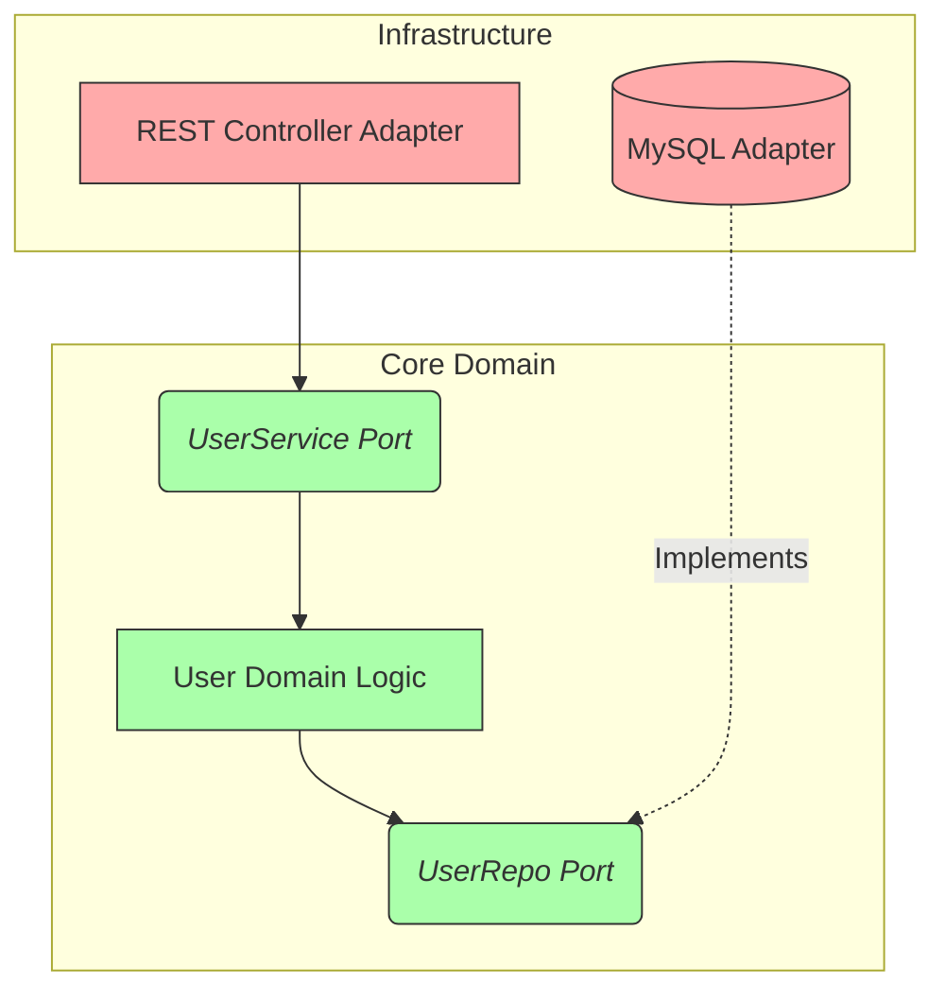
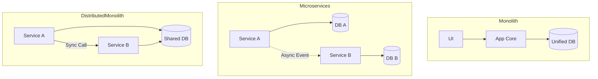
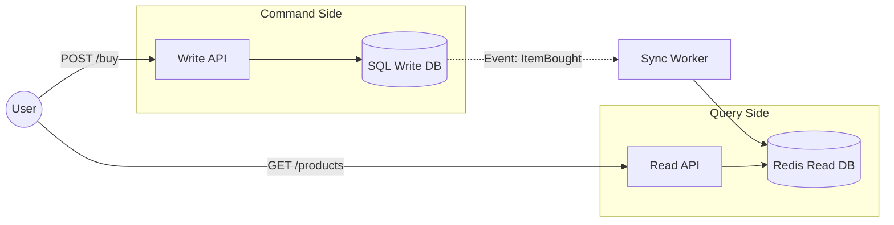
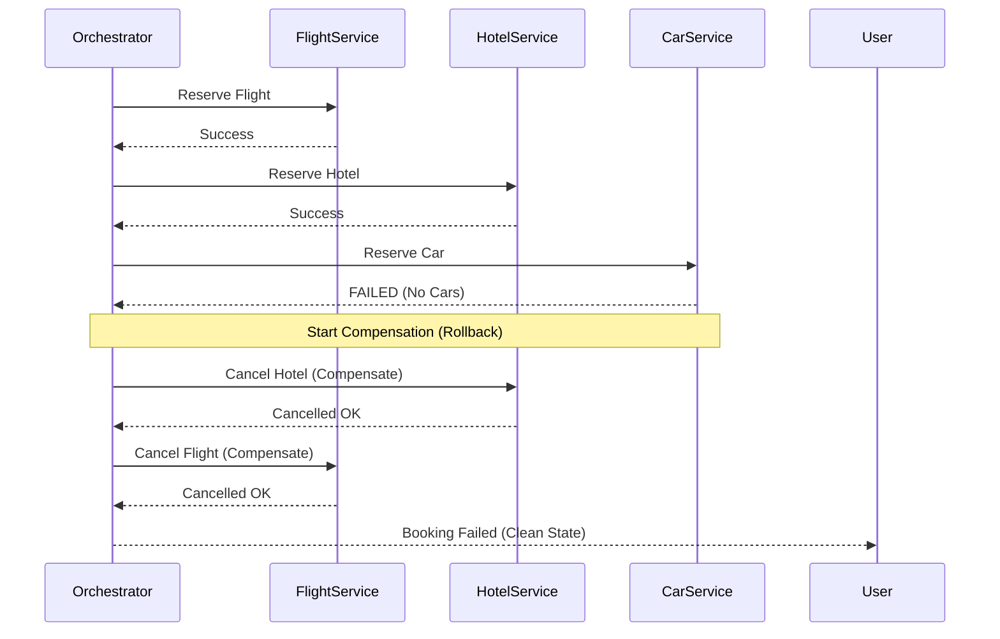

# RECURSOS VISUALES: ARQUITECTURA DE SOFTWARE

## 1. Arquitectura Hexagonal (Ports & Adapters)

Muestra cómo el Dominio está aislado del exterior.

## 2. Monolito vs Microservicios vs Monolito Distribuido

## 3. CQRS (Command Query Responsibility Segregation)

## 4. Patrón SAGA (Compensación)

