# ARQUITECTURA DEL SISTEMA - DIAGRAMA DE COMPONENTES

Este documento presenta diferentes vistas arquitectónicas del sistema de generación de cursos.

## 📐 VISTA DE COMPONENTES

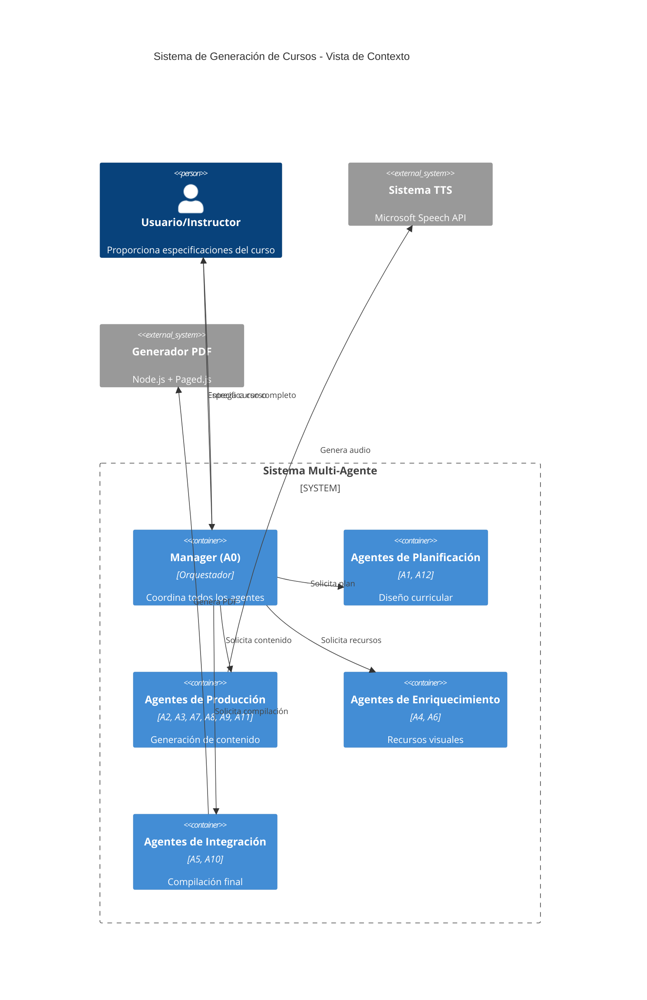

---

## 🏛️ ARQUITECTURA DE CAPAS

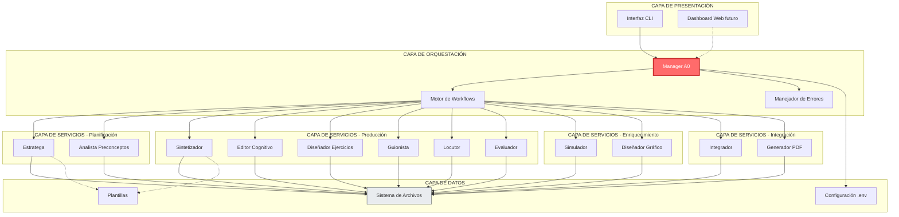

---

## 🔄 FLUJO DE DATOS

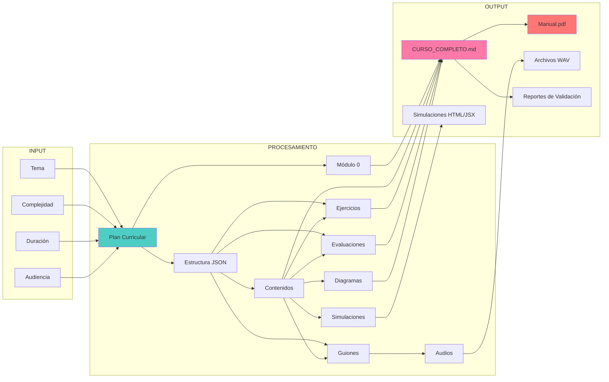

---

## 🎭 PATRONES DE DISEÑO UTILIZADOS

### 1. Patrón Orchestrator (Orquestador)

El Manager (A0) implementa el patrón Orchestrator:

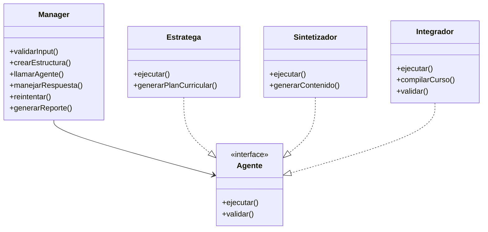

### 2. Patrón Pipeline

La producción de contenido sigue un pipeline:

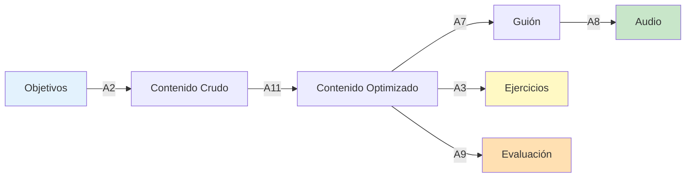

### 3. Patrón Chain of Responsibility

El manejo de errores utiliza cadena de responsabilidad:

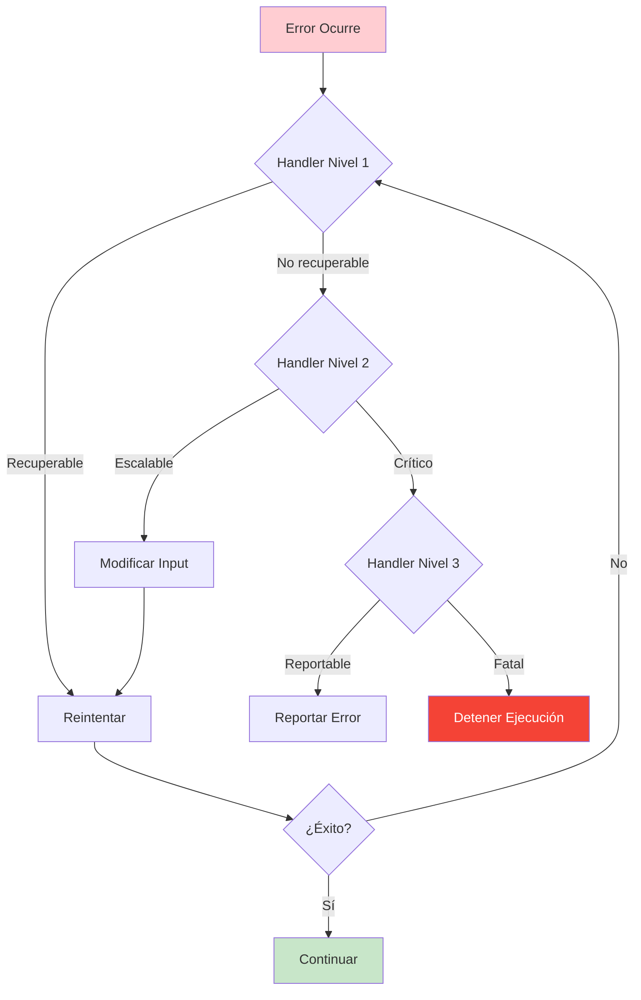

---

## 🌐 VISTA DE DESPLIEGUE

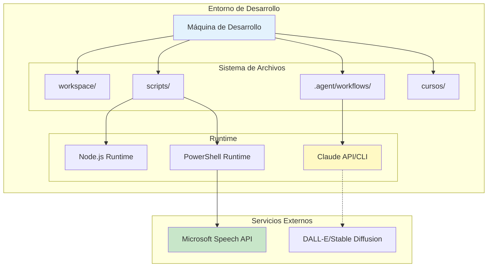

---

## 📊 MODELO DE DATOS

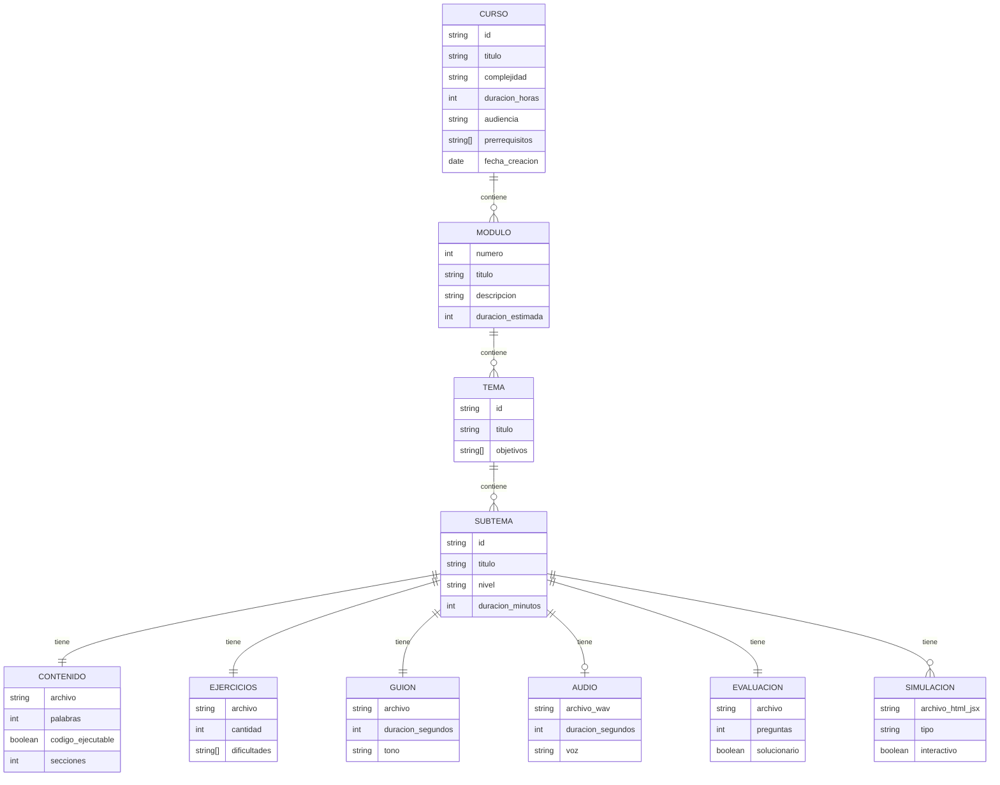

---

## 🔐 SEGURIDAD Y VALIDACIÓN

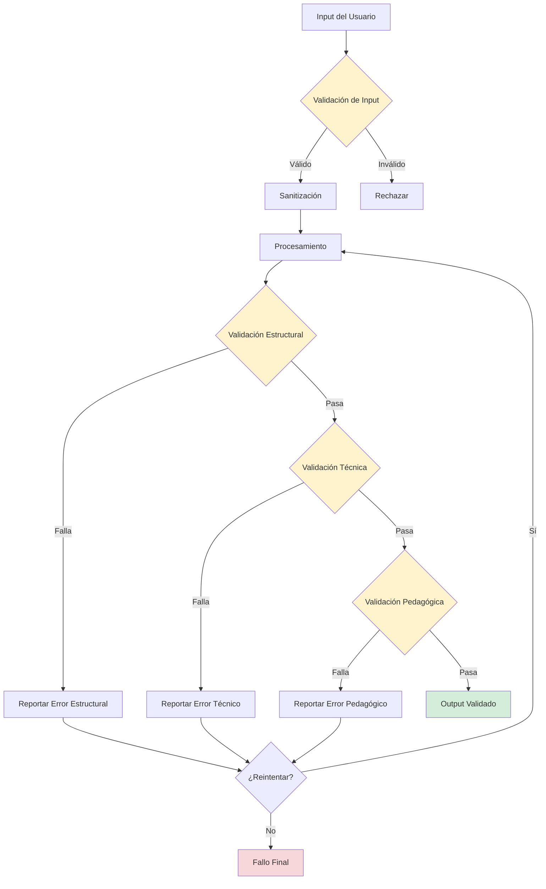

---

## 📈 MÉTRICAS Y OBSERVABILIDAD

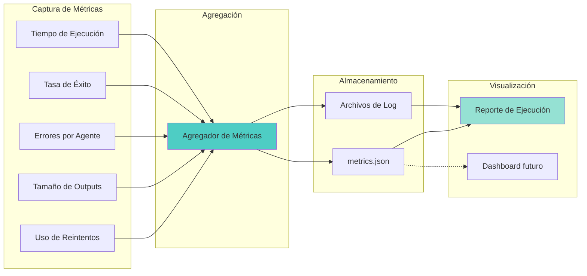

---

## 🔄 CICLO DE VIDA DEL CURSO

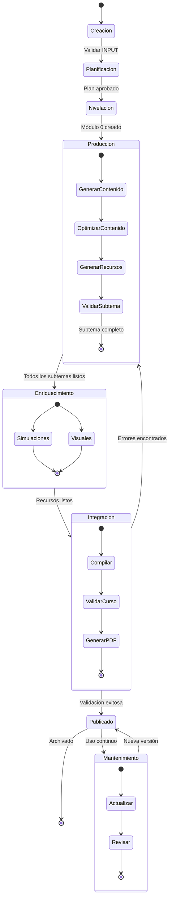

---

## 🎯 CONCLUSIÓN

Esta arquitectura proporciona:

✅ **Modularidad**: Cada agente es independiente y reutilizable  
✅ **Escalabilidad**: Fácil agregar nuevos agentes o funcionalidades  
✅ **Resiliencia**: Manejo robusto de errores con reintentos  
✅ **Observabilidad**: Métricas y logs en cada nivel  
✅ **Mantenibilidad**: Separación clara de responsabilidades  
✅ **Extensibilidad**: Arquitectura abierta para futuras mejoras  

El sistema está diseñado siguiendo principios SOLID y patrones de diseño reconocidos, garantizando calidad y sostenibilidad a largo plazo.
