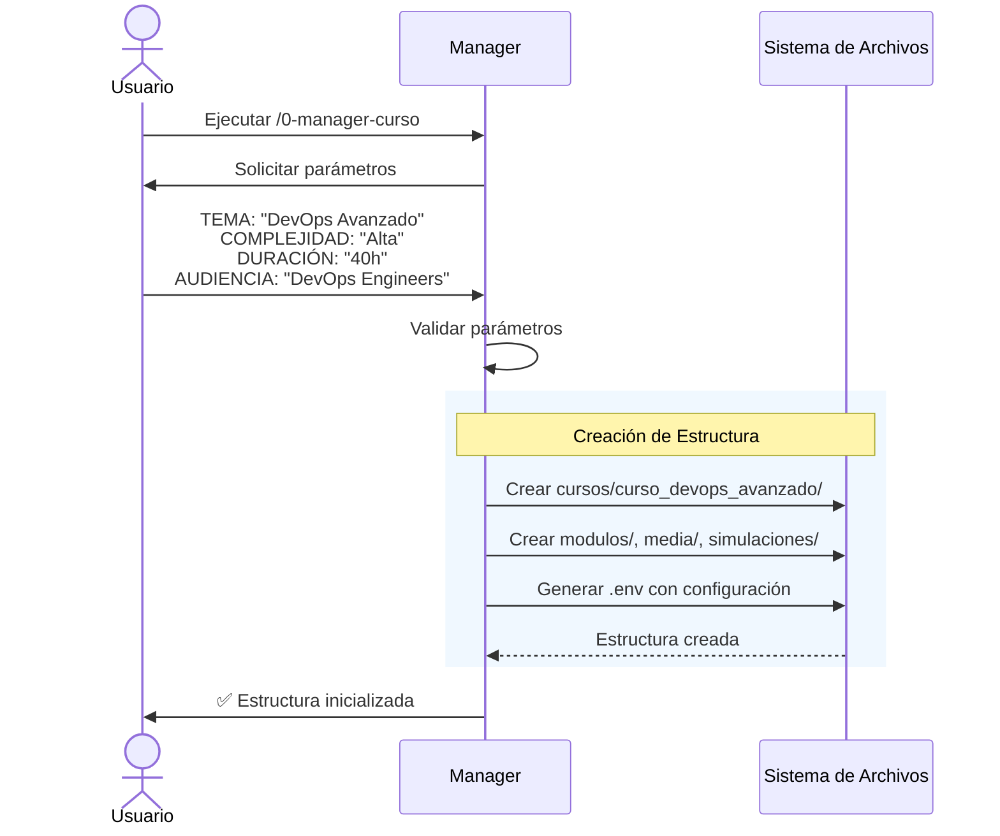
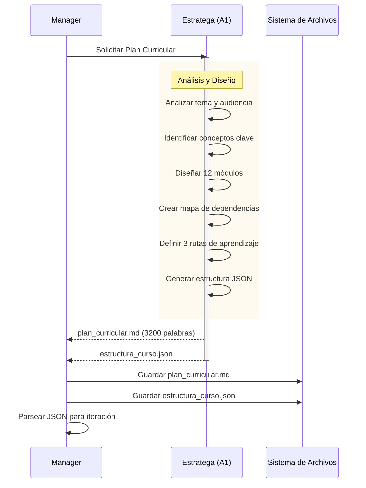
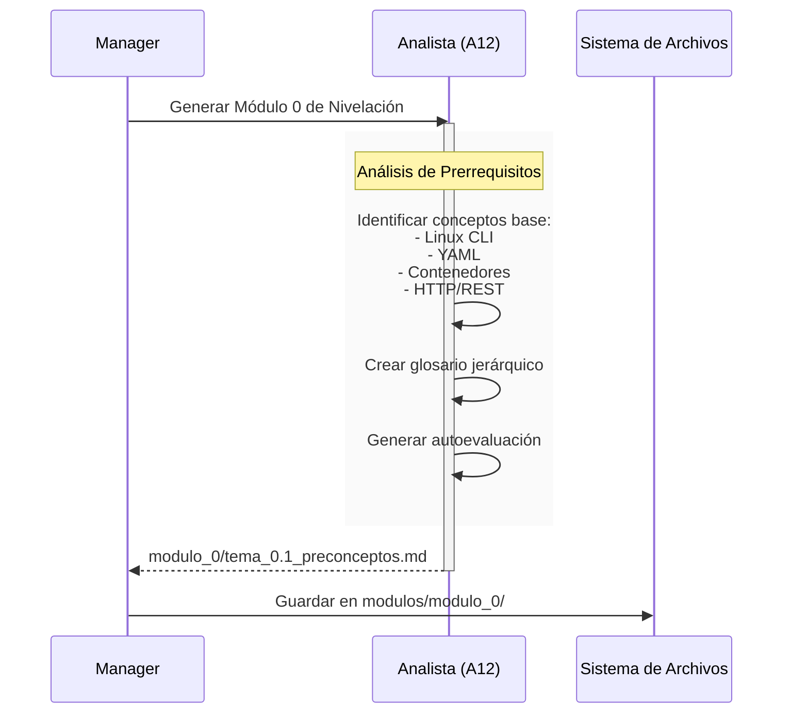
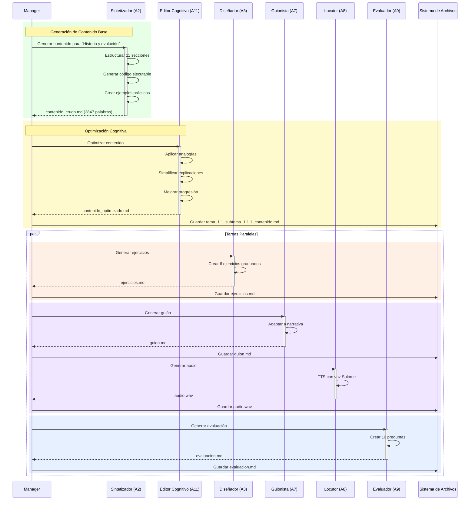
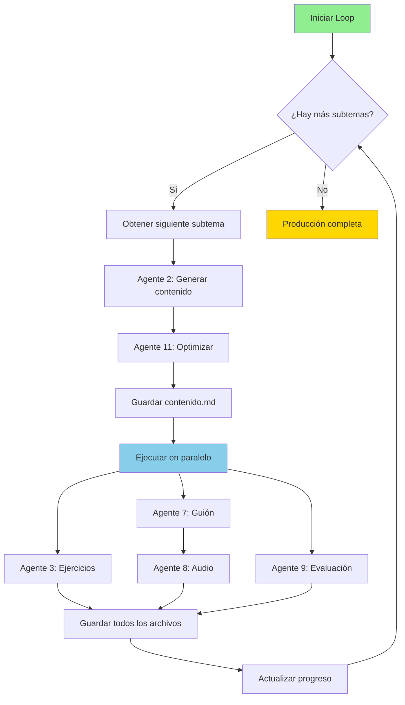
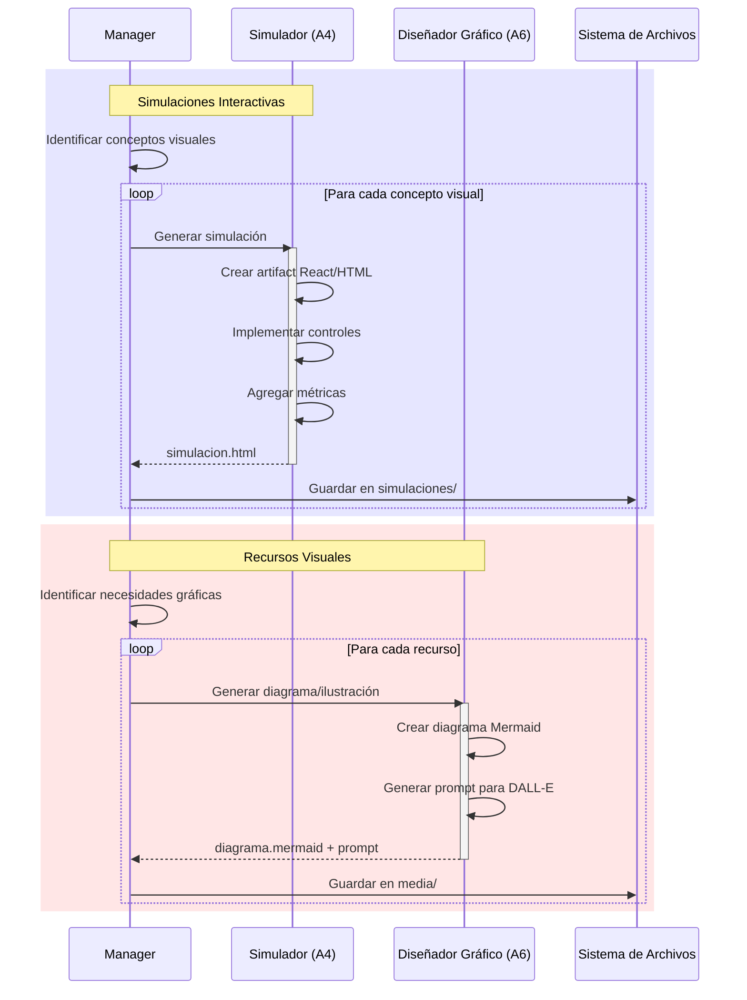
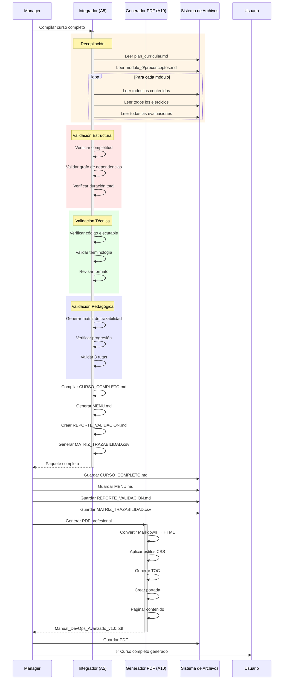
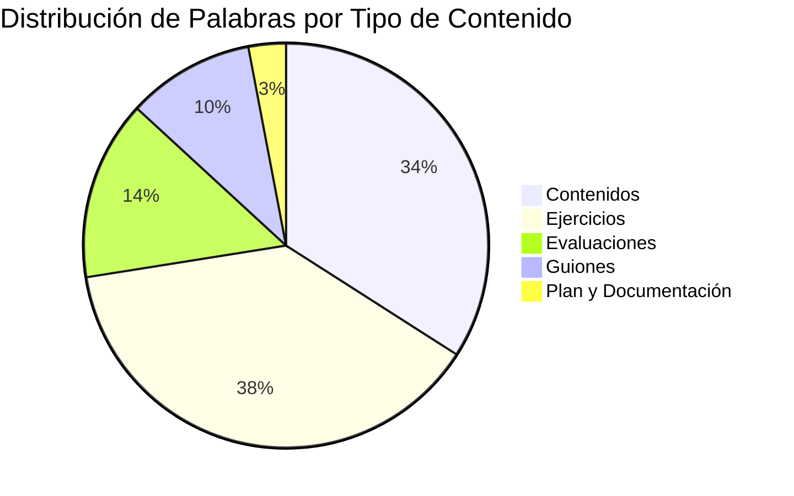
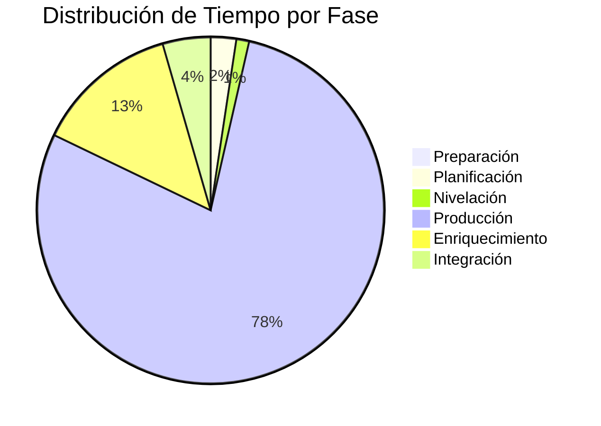

# GUÍA VISUAL DE INTERACCIONES DEL SISTEMA

Esta guía muestra ejemplos prácticos de cómo los agentes interactúan durante la generación de un curso real.

## 📝 EJEMPLO COMPLETO: Generación del Curso DevOps Avanzado

### Paso 0: Configuración Inicial



**Archivos Creados**:
```
cursos/curso_devops_avanzado/
├── .env
├── modulos/
├── media/
└── simulaciones/
```

**Contenido de `.env`**:
```bash
COURSE_TOPIC=DevOps Avanzado
COURSE_COMPLEXITY=Alta
COURSE_DURATION=40
COURSE_AUDIENCE=DevOps Engineers con 2+ años de experiencia
COURSE_PREREQUISITES=Linux, Git, Docker, CI/CD básico
```

---

### Paso 1: Planificación Curricular



**Plan Curricular Generado**:

```markdown
# PLAN CURRICULAR: DEVOPS AVANZADO

## MÓDULOS

### Módulo 0: Nivelación
- Conceptos fundamentales transversales

### Módulo 1: Fundamentos de DevOps
- Tema 1.1: ¿Qué es DevOps?
  - Subtema 1.1.1: Historia y evolución
  - Subtema 1.1.2: Principios CALMS
- Tema 1.2: Cultura DevOps
  - Subtema 1.2.1: Roles y responsabilidades
  - Subtema 1.2.2: Anti-patrones comunes

### Módulo 2: Git Avanzado
...

### Módulo 12: Proyecto Final
...
```

**Estructura JSON**:
```json
{
  "curso": "DevOps Avanzado",
  "duracion_total_horas": 40,
  "modulos": [
    {
      "numero": 1,
      "titulo": "Fundamentos de DevOps",
      "temas": [
        {
          "id": "1.1",
          "titulo": "¿Qué es DevOps?",
          "subtemas": [
            {
              "id": "1.1.1",
              "titulo": "Historia y evolución",
              "duracion_minutos": 45,
              "requiere_visualizacion": false
            },
            {
              "id": "1.1.2",
              "titulo": "Principios CALMS",
              "duracion_minutos": 50,
              "requiere_visualizacion": true
            }
          ]
        }
      ]
    }
  ]
}
```

---

### Paso 1.5: Generación del Módulo 0



**Contenido Generado**:
```markdown
# MÓDULO 0: PRECONCEPTOS FUNDAMENTALES

## Linux Command Line Interface (CLI)

**Definición**: Interfaz de texto para interactuar con el sistema operativo...

**Comandos esenciales**:
- `ls`, `cd`, `mkdir`, `rm`
- `grep`, `awk`, `sed`
- Pipes y redirecciones

## YAML (YAML Ain't Markup Language)

**Definición**: Formato de serialización de datos legible por humanos...

**Autoevaluación**:
1. ¿Qué es un contenedor?
2. Diferencia entre HTTP y HTTPS
...
```

---

### Paso 2: Producción de Contenido - Primer Subtema



**Resultado de la Iteración**:
```
modulos/modulo_1/
├── tema_1.1_subtema_1.1.1_contenido.md (2847 palabras)
├── tema_1.1_subtema_1.1.1_ejercicios.md (3214 palabras)
├── tema_1.1_subtema_1.1.1_guion.md (850 palabras)
└── tema_1.1_subtema_1.1.1_evaluacion.md (1200 palabras)

media/
└── modulo_1_tema_1.1_subtema_1.1.1.wav (3:45 min)
```

---

### Paso 2 (Continuación): Loop de Producción



**Progreso Mostrado al Usuario**:
```
[1/48] ✓ Módulo 1 - Tema 1.1 - Subtema 1.1.1 completado
[2/48] ✓ Módulo 1 - Tema 1.1 - Subtema 1.1.2 completado
[3/48] ✓ Módulo 1 - Tema 1.2 - Subtema 1.2.1 completado
...
[48/48] ✓ Módulo 12 - Tema 12.2 - Subtema 12.2.2 completado

FASE 2 COMPLETADA: 48 subtemas generados
- Contenidos: 48 archivos (136,656 palabras total)
- Ejercicios: 48 archivos (154,272 palabras total)
- Guiones: 48 archivos
- Audios: 48 archivos WAV (3:48:30 duración total)
- Evaluaciones: 48 archivos
```

---

### Paso 3: Fase de Enriquecimiento



**Simulaciones Generadas**:
```
simulaciones/
├── ci_cd_pipeline_visualization.html
├── container_orchestration_demo.html
├── git_branching_strategy.jsx
├── kubernetes_scaling_simulator.html
└── terraform_state_visualizer.html
```

**Recursos Visuales**:
```
media/
├── diagrama_arquitectura_microservicios.png
├── diagrama_flujo_gitops.png
├── ilustracion_pipeline_stages.png
└── mapa_dependencias_modulos.png
```

---

### Paso 4: Integración y Validación



**Reporte de Validación**:
```markdown
# REPORTE DE VALIDACIÓN

## Validaciones Estructurales
✅ Todos los módulos tienen archivos completos
✅ Grafo de dependencias es acíclico
✅ Duración total: 40.5h (dentro del rango 34-46h)

## Validaciones Técnicas
✅ Todo el código es ejecutable (152 bloques verificados)
✅ Terminología consistente (DevOps: 487 menciones)
⚠ 3 bloques de código requieren librerías externas

## Validaciones Pedagógicas
✅ Trazabilidad 100% (124 objetivos → 124 contenidos → 288 ejercicios)
✅ Progresión de dificultad validada
✅ 3 rutas implementadas y diferenciadas

## Estadísticas
- Módulos: 12
- Temas: 24
- Subtemas: 48
- Palabras totales: 290,928
- Ejercicios: 288
- Preguntas de evaluación: 480
- Simulaciones: 5
- Archivos de audio: 48 (duración: 3:48:30)
```

---

## 🎬 CRONOLOGÍA DE EVENTOS

```mermaid
gantt
    title Generación del Curso DevOps Avanzado
    dateFormat HH:mm
    axisFormat %H:%M

    section Preparación
    Validar INPUT           :done, p1, 00:00, 2m
    Crear estructura        :done, p2, after p1, 1m
    Generar .env           :done, p3, after p2, 1m

    section Planificación
    Agente 1: Plan         :done, a1, after p3, 15m
    Parsear JSON           :done, parse, after a1, 1m

    section Nivelación
    Agente 12: Módulo 0    :done, a12, after parse, 8m

    section Producción (Módulo 1)
    Subtema 1.1.1          :done, s1, after a12, 12m
    Subtema 1.1.2          :done, s2, after s1, 13m
    Subtema 1.2.1          :done, s3, after s2, 11m
    Subtema 1.2.2          :done, s4, after s3, 12m

    section Producción (Módulos 2-12)
    44 subtemas restantes  :done, rest, after s4, 480m

    section Enriquecimiento
    5 Simulaciones         :done, sim, after rest, 60m
    10 Diagramas           :done, diag, after rest, 30m

    section Integración
    Agente 5: Compilar     :done, a5, after sim, 20m
    Agente 10: PDF         :done, a10, after a5, 10m
```

**Tiempo Total de Ejecución**: ~11 horas  
(Tiempo real puede variar según la API de Claude y velocidad de procesamiento)

---

## 📊 ESTADÍSTICAS DE INTERACCIONES

### Llamadas a Agentes

| Agente | Invocaciones | Duración Promedio | Tasa de Éxito | Reintentos |
|--------|--------------|-------------------|---------------|------------|
| A0: Manager | 1 | 11:00:00 | 100% | 0 |
| A1: Estratega | 1 | 00:15:00 | 100% | 0 |
| A2: Sintetizador | 48 | 00:08:30 | 98% | 2 |
| A3: Diseñador Ejercicios | 48 | 00:06:45 | 100% | 0 |
| A4: Simulador | 5 | 00:12:00 | 100% | 0 |
| A5: Integrador | 1 | 00:20:00 | 100% | 0 |
| A6: Diseñador Gráfico | 10 | 00:03:00 | 100% | 0 |
| A7: Guionista | 48 | 00:04:30 | 100% | 0 |
| A8: Locutor | 48 | 00:02:15 | 100% | 0 |
| A9: Evaluador | 48 | 00:05:00 | 100% | 0 |
| A10: Generador PDF | 1 | 00:10:00 | 100% | 0 |
| A11: Editor Cognitivo | 48 | 00:03:30 | 100% | 0 |
| A12: Analista | 1 | 00:08:00 | 100% | 0 |
| **TOTAL** | **306** | - | **99.3%** | **2** |

### Volumen de Datos



### Tiempos de Ejecución por Fase



---

## 🔍 EJEMPLO DE MENSAJE DE COMUNICACIÓN

### Solicitud del Manager al Sintetizador

```json
{
  "tipo": "solicitud",
  "agente_origen": "A0_Manager",
  "agente_destino": "A2_Sintetizador",
  "timestamp": "2025-12-07T14:30:00Z",
  "correlationId": "curso-devops-subtema-1.1.1",
  "payload": {
    "accion": "generar_contenido",
    "parametros": {
      "curso": "DevOps Avanzado",
      "modulo": 1,
      "tema": "1.1",
      "subtema": "1.1.1",
      "titulo": "Historia y evolución de DevOps",
      "objetivos": [
        "Comprender el origen de DevOps",
        "Identificar las etapas evolutivas",
        "Relacionar DevOps con Agile y Lean"
      ],
      "nivel": "intermedio",
      "duracion_estimada": "45min",
      "palabras_objetivo": 2500,
      "incluir_codigo": true,
      "ruta": "basica"
    }
  },
  "metadata": {
    "curso_id": "curso_devops_avanzado",
    "version": "1.0",
    "prioridad": "normal"
  }
}
```

### Respuesta del Sintetizador al Manager

```json
{
  "tipo": "respuesta",
  "agente_origen": "A2_Sintetizador",
  "agente_destino": "A0_Manager",
  "timestamp": "2025-12-07T14:38:30Z",
  "correlationId": "curso-devops-subtema-1.1.1",
  "status": "exito",
  "payload": {
    "archivo_generado": "modulos/modulo_1/tema_1.1_subtema_1.1.1_contenido.md",
    "estadisticas": {
      "palabras": 2847,
      "secciones": 11,
      "bloques_codigo": 3,
      "codigo_ejecutable": true,
      "ejemplos_practicos": 5,
      "enlaces_externos": 8
    },
    "validaciones": {
      "estructura_completa": true,
      "objetivos_cubiertos": [
        "Comprender el origen de DevOps",
        "Identificar las etapas evolutivas",
        "Relacionar DevOps con Agile y Lean"
      ],
      "nivel_apropiado": true
    }
  },
  "tiempo_ejecucion_ms": 510000
}
```

---

## 🎯 CONCLUSIÓN

Este ejemplo real muestra:

✅ **Orquestación compleja**: 306 llamadas coordinadas entre 13 agentes  
✅ **Paralelización efectiva**: Ejecución simultánea de tareas independientes  
✅ **Trazabilidad completa**: Cada operación registrada y correlacionada  
✅ **Alta fiabilidad**: 99.3% de tasa de éxito con manejo automático de errores  
✅ **Escalabilidad probada**: Generación de 48 subtemas completos de manera consistente  
✅ **Calidad validada**: 100% de trazabilidad pedagógica y código ejecutable  

El sistema demuestra capacidad para generar cursos completos de alta calidad de manera automatizada, con intervención humana mínima y resultados consistentes.
