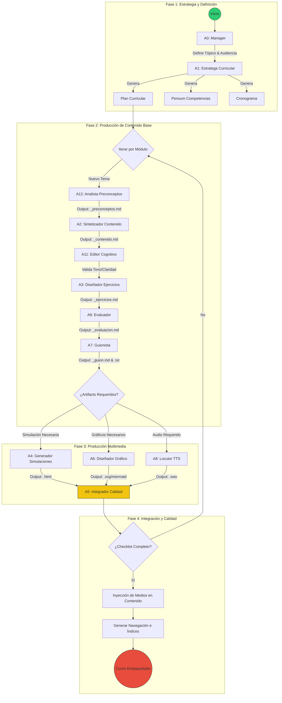
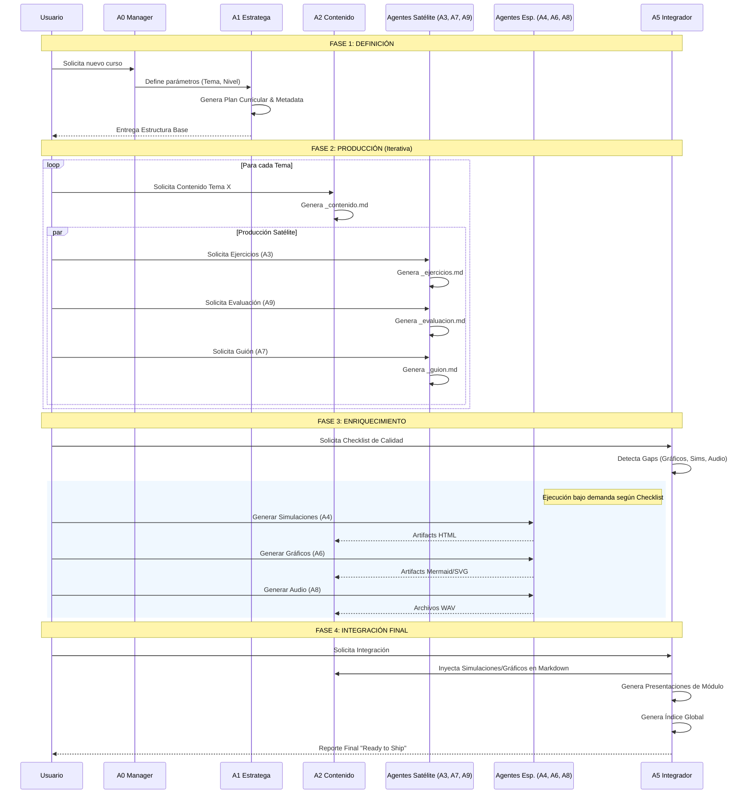

# 🗺️ MAPA DE PROCESOS: ARQUITECTURA DE AGENTES TEACH-LAOZ

Este documento detalla el flujo de trabajo orquestado para la generación masiva y de alta calidad de cursos educativos. Describe cómo interactúan los 12 agentes especializados para transformar una idea abstracta en un producto educativo completo.

---

## 1. DIAGRAMA DE FLUJO: EL PIPELINE DE PRODUCCIÓN

Este modelo (BPMN-style) ilustra la cadena de valor. El proceso no es lineal, es incremental e iterativo, con compuertas de calidad estrictas.

### 🟢 Fase 1: Estrategia y Definición (El Cerebro)

Todo comienza con el **Agente 0 (Manager)** y el **Agente 1 (Estratega)**. Aquí no se produce contenido, se define la _estructura_ y el _propósito_.

- **Plan Curricular**: El esqueleto del curso. Si falla aquí, todo falla.
- **Pensum**: Define qué competencias tendrá el estudiante al final.

### 🔵 Fase 2: Producción Core (El Cuerpo)

Es el bucle principal. Por cada tema definido en la Fase 1, se activa una célula de producción:

1. **A12 (Analista)**: Prepara el terreno identificando preconceptos y analogías. Evita que el contenido sea muy difícil o muy trivial.
2. **A2 (Sintetizador)**: Genera la "verdad" del curso (el archivo `_contenido.md`).
3. **Satélites (A3, A9, A7)**: Generan los artefactos derivados (Ejercicios, Evaluaciones, Guiones) basados _únicamente_ en el contenido validado por A2. Esto asegura coherencia.

### 🟡 Fase 3: Especialistas Multimedia (Los Sentidos)

Una vez el texto es sólido, entran los especialistas bajo demanda (Lazy Loading).

- **A4 (Simulaciones)**: Crea interactividad (HTML/JS) para conceptos complejos.
- **A6 (Gráfico)**: Traduce texto a diagramas (Mermaid/SVG).
- **A8 (Voz)**: Convierte los guiones de A7 en audio real.

### 🔴 Fase 4: Integración y Calidad (El Auditor)

El **Agente 5** es el guardián.

- **Checklist**: Verifica que no falte nada (Fase 0 validation).
- **Inyección**: Incrusta los medios (Fase 3) dentro del texto (Fase 2).
- **Empaquetado**: Genera la navegación, índices y guías de estudio. Solo entonces el curso es "Shippable".

---

## 2. DIAGRAMA DE SECUENCIA: ORQUESTACIÓN TEMPORAL

Este diagrama detalla el _protocolo de comunicación_. Muestra quién llama a quién y en qué orden.

### Puntos Clave de la Secuencia

1. **Paralelismo Satélite**: Notar que A3 (Ejercicios), A9 (Evaluador) y A7 (Guionista) pueden trabajar en paralelo una vez A2 (Contenido) ha terminado. No tienen dependencias entre sí, solo dependen de A2.
2. **Validación Tardía**: A5 (Integrador) entra al final. Esto es intencional. Permite velocidad en la producción y rigor en el cierre.
3. **Bucle de Feedback**: Si A5 detecta "Gaps" (brechas), reactiva a los agentes específicos (A4, A6, A8) para llenar los huecos sin detener al resto del sistema.

## 3. DIRECTORIO DE AGENTES

A continuación se listan los especialistas que componen el sistema, con enlaces a su definición operativa (workflows):

| Agente  | Rol                                                                       | Responsabilidad Principal                                     | Definición |
| :-----: | :------------------------------------------------------------------------ | :------------------------------------------------------------ | :--------: |
| **A0**  | [Manager de Curso](../.agent/workflows/0-manager-curso.md)                   | Orquestación global y definición de parámetros iniciales.     |     📜     |
| **A1**  | [Estratega Curricular](../.agent/workflows/1-estratega-curricular.md)        | Diseño de arquitectura pedagógica (Plan, Pensum, Cronograma). |     📜     |
| **A12** | [Analista de Preconceptos](../.agent/workflows/12-analista-preconceptos.md)  | Detección de barreras cognitivas y analogías base.            |     📜     |
| **A2**  | [Sintetizador de Contenido](../.agent/workflows/2-sintetizador-contenido.md) | Generación del contenido teórica central (`_contenido.md`).   |     📜     |
| **A11** | [Editor Cognitivo](../.agent/workflows/11-editor-cognitivo.md)               | Refinamiento de tono, claridad y estilo Socrático.            |     📜     |
| **A3**  | [Diseñador de Ejercicios](../.agent/workflows/3-disenador-ejercicios.md)     | Creación de prácticas graduadas y casos de estudio.           |     ��     |
| **A9**  | [Evaluador](../.agent/workflows/9-evaluador.md)                              | Diseño de quizzes y validación de conocimientos.              |     📜     |
| **A7**  | [Guionista](../.agent/workflows/7-guionista.md)                              | Adaptación del contenido técnico a narrativa de audio.        |     📜     |
| **A4**  | [Generador de Simulaciones](../.agent/workflows/4-generador-simulaciones.md) | Desarrollo de artifacts interactivos (HTML/JS/React).         |     📜     |
| **A6**  | [Diseñador Gráfico](../.agent/workflows/6-disenador-grafico.md)              | Visualización de conceptos mediante diagramas (Mermaid/SVG).  |     📜     |
| **A8**  | [Locutor](../.agent/workflows/8-locutor.md)                                  | Conversión de guiones a audio (TTS).                          |     📜     |
| **A5**  | [Integrador de Calidad](../.agent/workflows/5-integrador-calidad.md)         | Auditoría, ensamblaje y empaquetado final del curso.          |     📜     |
