# DOCUMENTACIÓN DE WORKFLOWS Y FLUJOS DE INTERACCIÓN

Este documento detalla los workflows específicos de cada agente y cómo interactúan entre sí durante la generación de un curso.

## 📋 TABLA DE CONTENIDOS

1. [Workflow del Manager (Agente 0)](#workflow-del-manager-agente-0)
2. [Workflow de Producción de Contenido](#workflow-de-producción-de-contenido)
3. [Workflow de Generación de Audio](#workflow-de-generación-de-audio)
4. [Workflow de Integración](#workflow-de-integración)
5. [Protocolos de Comunicación](#protocolos-de-comunicación)
6. [Manejo de Errores y Reintentos](#manejo-de-errores-y-reintentos)

---

## WORKFLOW DEL MANAGER (AGENTE 0)

El Manager es el orquestador principal. Su flujo de trabajo es:


### Fases del Manager

#### FASE 0: PREPARACIÓN

```javascript
// Pseudocódigo del Manager - Fase 0
function fase0_preparacion(userInput) {
  // 1. Validar INPUT
  if (!userInput.tema || !userInput.complejidad) {
    return solicitarInformacionFaltante(userInput);
  }

  // 2. Crear estructura de directorios
  const courseDir = `cursos/curso_${sanitize(userInput.tema)}`;
  crearDirectorio(courseDir);
  crearDirectorio(`${courseDir}/modulos`);
  crearDirectorio(`${courseDir}/media`);
  crearDirectorio(`${courseDir}/simulaciones`);

  // 3. Generar archivo .env
  const envConfig = generarConfiguracion(userInput);
  guardarArchivo(`${courseDir}/.env`, envConfig);

  return courseDir;
}
```

#### FASE 1: PLANIFICACIÓN

```javascript
// Pseudocódigo del Manager - Fase 1
async function fase1_planificacion(courseDir, userInput) {
    // Llamar Agente 1
    const planCurricular = await llamarAgente(
        agente: 'A1_Estratega',
        input: userInput,
        outputFile: `${courseDir}/plan_curricular.md`
    );

    // Extraer JSON del plan
    const estructuraJSON = parsearJSON(planCurricular);
    guardarArchivo(`${courseDir}/estructura_curso.json`, estructuraJSON);

    return estructuraJSON;
}
```

#### FASE 1.5: NIVELACIÓN

```javascript
// Pseudocódigo del Manager - Fase 1.5
async function fase1_5_nivelacion(courseDir, planCurricular) {
    const module0 = await llamarAgente(
        agente: 'A12_Analista',
        input: planCurricular,
        outputFile: `${courseDir}/modulos/modulo_0/tema_0.1_preconceptos.md`
    );

    return module0;
}
```

#### FASE 2: PRODUCCIÓN ITERATIVA

```javascript
// Pseudocódigo del Manager - Fase 2
async function fase2_produccion(courseDir, estructuraJSON) {
    for (const modulo of estructuraJSON.modulos) {
        for (const tema of modulo.temas) {
            for (const subtema of tema.subtemas) {
                // Generar contenido
                const contenidoCrudo = await llamarAgente(
                    agente: 'A2_Sintetizador',
                    input: subtema,
                    outputFile: `${courseDir}/modulos/modulo_${modulo.id}/tema_${tema.id}_subtema_${subtema.id}_contenido.md`
                );

                // Optimizar contenido
                const contenidoOptimizado = await llamarAgente(
                    agente: 'A11_EditorCognitivo',
                    input: contenidoCrudo,
                    outputFile: `${courseDir}/modulos/modulo_${modulo.id}/tema_${tema.id}_subtema_${subtema.id}_contenido.md` // Sobrescribir
                );

                // Tareas paralelas
                await Promise.all([
                    // Ejercicios
                    llamarAgente(
                        agente: 'A3_DisenadorEjercicios',
                        input: contenidoOptimizado,
                        outputFile: `${courseDir}/modulos/modulo_${modulo.id}/tema_${tema.id}_subtema_${subtema.id}_ejercicios.md`
                    ),

                    // Guión y Audio (secuencial)
                    (async () => {
                        const guion = await llamarAgente(
                            agente: 'A7_Guionista',
                            input: contenidoOptimizado,
                            outputFile: `${courseDir}/modulos/modulo_${modulo.id}/tema_${tema.id}_subtema_${subtema.id}_guion.md`
                        );

                        await llamarAgente(
                            agente: 'A8_Locutor',
                            input: guion,
                            outputFile: `${courseDir}/media/modulo_${modulo.id}_tema_${tema.id}_subtema_${subtema.id}.wav`
                        );
                    })(),

                    // Evaluación
                    llamarAgente(
                        agente: 'A9_Evaluador',
                        input: contenidoOptimizado,
                        outputFile: `${courseDir}/modulos/modulo_${modulo.id}/tema_${tema.id}_subtema_${subtema.id}_evaluacion.md`
                    )
                ]);
            }
        }
    }
}
```

---

## WORKFLOW DE PRODUCCIÓN DE CONTENIDO

Flujo detallado de cómo se produce el contenido de cada subtema:

```mermaid
sequenceDiagram
    participant M as Manager
    participant A2 as Sintetizador
    participant A11 as Editor Cognitivo
    participant FS as Sistema de Archivos

    M->>A2: Solicitar contenido (objetivos, nivel, contexto)
    activate A2
    A2->>A2: Estructurar contenido (11 secciones)
    A2->>A2: Generar código ejecutable
    A2->>A2: Crear ejemplos prácticos
    A2-->>M: Contenido crudo (2500-3000 palabras)
    deactivate A2

    M->>FS: Guardar temp/contenido_crudo.md

    M->>A11: Optimizar contenido crudo
    activate A11
    A11->>A11: Aplicar analogías
    A11->>A11: Simplificar explicaciones
    A11->>A11: Mejorar progresión
    A11->>A11: Optimizar ejemplos
    A11-->>M: Contenido optimizado
    deactivate A11

    M->>FS: Guardar modulo_X/tema_Y_subtema_Z_contenido.md
    FS-->>M: Confirmación de guardado
```



### Estructura del Contenido Generado

Cada archivo `*_contenido.md` sigue esta estructura de 11 secciones:

1. **Contexto y Motivación**: Por qué es importante este concepto
2. **Fundamentos Teóricos**: Base conceptual sólida
3. **Implementación Práctica**: Cómo aplicarlo
4. **Código Ejecutable**: Ejemplos funcionales con tests
5. **Casos de Uso Reales**: Aplicaciones en el mundo real
6. **Comparación con Alternativas**: Pros/cons vs otros enfoques
7. **Mejores Prácticas**: Recomendaciones de expertos
8. **Errores Comunes**: Qué evitar
9. **Recursos Adicionales**: Para profundizar
10. **Resumen Ejecutivo**: Síntesis del contenido
11. **Puntos Clave**: Bullets de conceptos esenciales

---

## WORKFLOW DE GENERACIÓN DE AUDIO

El proceso de conversión de texto a audio:

```mermaid
flowchart LR
    A[Contenido del Subtema] --> B[Agente 7: Guionista]
    B --> C{Formato del Guión}

    C -->|Formato Largo| D[Guión con Timestamps]
    C -->|Formato Corto| E[Guión Inline]
    C -->|Formato Ultra-corto| F[Solo Texto]

    D --> G[Archivo *_guion.md]
    E --> G
    F --> G

    G --> H[Script: generate_all_audios.ps1]

    H --> I[Buscar archivos *_guion.md]
    I --> J[Extraer texto del locutor]

    J --> K{¿Marcador LOCUTOR?}
    K -->|Sí| L[Extraer con regex]
    K -->|No| M[Usar todo el contenido]

    L --> N[Limpiar y normalizar texto]
    M --> N

    N --> O[System.Speech TTS]
    O --> P[Configurar voz: Microsoft Salome Desktop - Spanish Colombia]
    P --> Q[Generar audio WAV]

    Q --> R[Guardar en media/modulo_X_tema_Y_subtema_Z.wav]

    style H fill:#FFD700
    style O fill:#87CEEB
    style R fill:#90EE90
```



### Script de Generación de Audio

El script `generate_all_audios.ps1` sigue este algoritmo:

```powershell
# Pseudocódigo del script de audio
function Generate-AllAudios($BaseDirectory) {
    # 1. Buscar todos los archivos *_guion.md
    $guionFiles = Get-ChildItem -Path $BaseDirectory -Filter "*_guion.md" -Recurse

    # 2. Para cada guión
    foreach ($guion in $guionFiles) {
        # 3. Extraer texto
        $texto = Extract-ScriptText($guion.FullName)

        if ($texto) {
            # 4. Determinar nombre de audio
            $audioFile = Get-AudioFileName($guion.FullName)

            # 5. Generar audio
            $synthesizer.SetOutputToWaveFile($audioFile)
            $synthesizer.Speak($texto)

            Write-Host "✓ Audio generado: $audioFile"
        } else {
            Write-Warning "⚠ No se pudo extraer texto: $guion"
        }
    }
}

function Extract-ScriptText($filePath) {
    $content = Get-Content -Raw $filePath

    # Intentar con marcador [LOCUTOR]
    $matches = [regex]::Matches($content, '\*\*\[LOCUTOR\]\*\*:?\s*(.*?)(?=\n###|\*\*\[LOCUTOR\]\*\*|\z)')

    if ($matches.Count -gt 0) {
        # Formato con marcador
        return ($matches.Groups[1].Value -join ' ').Trim()
    } else {
        # Formato sin marcador - usar todo el contenido
        return ($content | Where-Object { $_ -notmatch '^#{1,6}\s|^-{3,}$' }) -join ' '
    }
}
```

### Formatos de Guión Soportados

#### Formato Largo (con secciones)

```markdown
### 00:00 - INTRODUCCIÓN

**[LOCUTOR]**:
Texto del guión aquí...

### 01:30 - DESARROLLO

**[LOCUTOR]**:
Más texto...
```

#### Formato Corto (inline)

```markdown
**[LOCUTOR]**: Todo el texto en una sola línea...
```

#### Formato Ultra-corto (sin marcador)

```markdown
Solo texto directo sin ningún marcador.
```

---

## WORKFLOW DE INTEGRACIÓN

El Agente 5 (Integrador) realiza la compilación final:

```mermaid
flowchart TD
    Start[Inicio Integración] --> Recolectar[Recolectar todos los archivos]

    Recolectar --> ValidarEstructura{¿Estructura completa?}
    ValidarEstructura -->|No| ReportarFaltantes[Reportar archivos faltantes]
    ReportarFaltantes --> End1[Fin con errores]

    ValidarEstructura -->|Sí| GenerarTOC[Generar Tabla de Contenidos]
    GenerarTOC --> CompilarContenido[Compilar todo el contenido]

    CompilarContenido --> ValidarTecnica{¿Código ejecutable?}
    ValidarTecnica -->|No| ReportarErrores[Reportar errores técnicos]
    ReportarErrores --> End1

    ValidarTecnica -->|Sí| ValidarPedagogica{¿Trazabilidad 100%?}
    ValidarPedagogica -->|No| ReportarGaps[Reportar gaps pedagógicos]
    ReportarGaps --> End1

    ValidarPedagogica -->|Sí| GenerarMatriz[Generar Matriz de Trazabilidad]
    GenerarMatriz --> GenerarMenu[Generar MENU.md]
    GenerarMenu --> GenerarGuias[Generar Guías de Uso]

    GenerarGuias --> GuardarCurso[Guardar CURSO_COMPLETO.md]
    GuardarCurso --> GenerarReporte[Generar REPORTE_VALIDACION.md]

    GenerarReporte --> End2[Fin exitoso]

    style Start fill:#90EE90
    style End1 fill:#FFB6C1
    style End2 fill:#90EE90
    style ValidarEstructura fill:#FFD700
    style ValidarTecnica fill:#FFD700
    style ValidarPedagogica fill:#FFD700
```



### Validaciones del Integrador

El Agente 5 realiza tres tipos de validaciones:

#### 1. Validación Estructural

```javascript
// Validaciones estructurales
const validacionesEstructurales = {
  // Verificar que todos los módulos tienen todos los archivos
  verificarCompletitud: (modulos) => {
    for (const modulo of modulos) {
      const archivosRequeridos = [
        `tema_*_contenido.md`,
        `tema_*_ejercicios.md`,
        `tema_*_evaluacion.md`,
        `tema_*_guion.md`,
      ];

      for (const archivo of archivosRequeridos) {
        if (!existe(archivo)) {
          reportarError(`Falta archivo: ${archivo}`);
        }
      }
    }
  },

  // Verificar grafo de dependencias acíclico
  verificarGrafoDependencias: (estructura) => {
    const grafo = construirGrafo(estructura);
    if (tieneCiclos(grafo)) {
      reportarError("El grafo de dependencias tiene ciclos");
    }
  },

  // Verificar duración dentro del rango
  verificarDuracion: (estructura, duracionObjetivo) => {
    const duracionTotal = calcularDuracion(estructura);
    const margen = duracionObjetivo * 0.15; // ±15%

    if (Math.abs(duracionTotal - duracionObjetivo) > margen) {
      reportarWarning(
        `Duración fuera de rango: ${duracionTotal}h vs ${duracionObjetivo}h`
      );
    }
  },
};
```

#### 2. Validación Técnica

```javascript
// Validaciones técnicas
const validacionesTecnicas = {
  // Verificar que el código es ejecutable
  verificarCodigoEjecutable: (contenido) => {
    const bloquesCodigo = extraerBloquesCodigo(contenido);

    for (const bloque of bloquesCodigo) {
      try {
        ejecutar(bloque.codigo);
      } catch (error) {
        reportarError(`Código no ejecutable: ${error.message}`);
      }
    }
  },

  // Verificar terminología consistente
  verificarTerminologia: (curso) => {
    const terminos = extraerTerminos(curso);
    const inconsistencias = detectarInconsistencias(terminos);

    for (const inconsistencia of inconsistencias) {
      reportarWarning(`Terminología inconsistente: ${inconsistencia}`);
    }
  },
};
```

#### 3. Validación Pedagógica

```javascript
// Validaciones pedagógicas
const validacionesPedagogicas = {
  // Verificar trazabilidad objetivo→contenido→ejercicio
  verificarTrazabilidad: (estructura) => {
    for (const objetivo of estructura.objetivos) {
      // Verificar que hay contenido que cubre el objetivo
      const contenidoRelacionado = buscarContenido(objetivo);
      if (!contenidoRelacionado) {
        reportarError(`Objetivo sin contenido: ${objetivo.id}`);
      }

      // Verificar que hay ejercicios que evalúan el objetivo
      const ejerciciosRelacionados = buscarEjercicios(objetivo);
      if (!ejerciciosRelacionados || ejerciciosRelacionados.length === 0) {
        reportarError(`Objetivo sin ejercicios: ${objetivo.id}`);
      }
    }
  },

  // Verificar progresión de dificultad
  verificarProgresion: (ejercicios) => {
    for (let i = 1; i < ejercicios.length; i++) {
      if (ejercicios[i].dificultad < ejercicios[i - 1].dificultad) {
        reportarWarning(
          `Progresión de dificultad inconsistente en ejercicio ${i}`
        );
      }
    }
  },

  // Verificar 3 rutas implementadas
  verificarRutas: (estructura) => {
    const rutasRequeridas = ["basica", "intermedia", "avanzada"];

    for (const ruta of rutasRequeridas) {
      if (!estructura.rutas[ruta]) {
        reportarError(`Falta implementación de ruta: ${ruta}`);
      }
    }
  },
};
```

---

## PROTOCOLOS DE COMUNICACIÓN

### Formato de Mensajes entre Agentes

Todos los agentes se comunican usando un formato estandarizado:

```json
{
  "tipo": "solicitud | respuesta | error",
  "agente_origen": "A0_Manager",
  "agente_destino": "A2_Sintetizador",
  "timestamp": "2025-12-07T10:30:00Z",
  "correlationId": "curso-123-subtema-456",
  "payload": {
    "accion": "generar_contenido",
    "parametros": {
      "modulo": 1,
      "tema": 1,
      "subtema": 1,
      "titulo": "Introducción a DevOps",
      "objetivos": ["Comprender qué es DevOps", "..."],
      "nivel": "intermedio",
      "duracion_estimada": "45min"
    }
  },
  "metadata": {
    "curso_id": "curso_devops_avanzado",
    "version": "1.0",
    "prioridad": "normal"
  }
}
```

### Tipos de Respuesta

#### Respuesta Exitosa

```json
{
  "tipo": "respuesta",
  "agente_origen": "A2_Sintetizador",
  "agente_destino": "A0_Manager",
  "timestamp": "2025-12-07T10:35:00Z",
  "correlationId": "curso-123-subtema-456",
  "status": "exito",
  "payload": {
    "archivo_generado": "modulo_1/tema_1_subtema_1_contenido.md",
    "palabras": 2847,
    "codigo_ejecutable": true,
    "secciones_completadas": 11
  }
}
```

#### Respuesta con Error

```json
{
  "tipo": "error",
  "agente_origen": "A2_Sintetizador",
  "agente_destino": "A0_Manager",
  "timestamp": "2025-12-07T10:35:00Z",
  "correlationId": "curso-123-subtema-456",
  "error": {
    "codigo": "CONTENIDO_INSUFICIENTE",
    "mensaje": "No se pudo generar contenido de 2500 palabras con los objetivos proporcionados",
    "detalles": {
      "palabras_generadas": 1200,
      "objetivos_cubiertos": 2,
      "objetivos_totales": 5
    },
    "recuperable": true,
    "sugerencias": [
      "Proporcionar más contexto sobre los objetivos",
      "Reducir el número de objetivos",
      "Aumentar la duración estimada"
    ]
  }
}
```

---

## MANEJO DE ERRORES Y REINTENTOS

### Estrategia de Reintentos

```mermaid
flowchart TD
    Ejecutar[Ejecutar Agente] --> Exito{¿Éxito?}

    Exito -->|Sí| Continuar[Continuar flujo]
    Exito -->|No| Recuperable{¿Error recuperable?}

    Recuperable -->|No| Fallar[Reportar error y detener]
    Recuperable -->|Sí| ContarReintentos{¿Reintentos < 3?}

    ContarReintentos -->|No| Fallar
    ContarReintentos -->|Sí| Esperar[Esperar backoff exponencial]

    Esperar --> ModificarInput[Modificar input según sugerencias]
    ModificarInput --> Ejecutar

    style Continuar fill:#90EE90
    style Fallar fill:#FFB6C1
```



### Implementación de Reintentos

```javascript
// Estrategia de reintentos con backoff exponencial
async function ejecutarAgenteConReintentos(agente, input, maxReintentos = 3) {
  let intentos = 0;
  let delayBase = 1000; // 1 segundo

  while (intentos < maxReintentos) {
    try {
      const resultado = await ejecutarAgente(agente, input);

      if (resultado.status === "exito") {
        return resultado;
      } else if (resultado.error && !resultado.error.recuperable) {
        throw new Error(`Error no recuperable: ${resultado.error.mensaje}`);
      }

      // Error recuperable - aplicar sugerencias
      if (resultado.error.sugerencias) {
        input = aplicarSugerencias(input, resultado.error.sugerencias);
      }

      // Esperar con backoff exponencial
      const delay = delayBase * Math.pow(2, intentos);
      await sleep(delay);

      intentos++;
    } catch (error) {
      if (intentos >= maxReintentos - 1) {
        throw error;
      }
      intentos++;
    }
  }

  throw new Error(`Máximo de reintentos alcanzado para agente ${agente}`);
}
```

### Tipos de Errores

| Código de Error          | Descripción                         | Recuperable | Acción                         |
| ------------------------ | ----------------------------------- | ----------- | ------------------------------ |
| `INPUT_INVALIDO`         | Parámetros de entrada inválidos     | Sí          | Solicitar corrección           |
| `CONTENIDO_INSUFICIENTE` | No se alcanzó el mínimo de palabras | Sí          | Ampliar contexto               |
| `CODIGO_NO_EJECUTABLE`   | El código generado no compila       | Sí          | Regenerar código               |
| `ARCHIVO_NO_ENCONTRADO`  | Archivo requerido no existe         | Sí          | Generar archivo faltante       |
| `DEPENDENCIA_CIRCULAR`   | Ciclo en grafo de dependencias      | No          | Rediseñar estructura           |
| `TIMEOUT`                | Tiempo de ejecución excedido        | Sí          | Reintentar                     |
| `FORMATO_INVALIDO`       | Formato de salida incorrecto        | Sí          | Regenerar con formato correcto |
| `VALIDACION_FALLIDA`     | Validación estructural falló        | No          | Revisar arquitectura           |

---

## MONITOREO Y LOGS

### Sistema de Logging

Cada agente genera logs estructurados:

```json
{
  "timestamp": "2025-12-07T10:30:15.234Z",
  "nivel": "INFO | WARNING | ERROR",
  "agente": "A2_Sintetizador",
  "correlationId": "curso-123-subtema-456",
  "mensaje": "Contenido generado exitosamente",
  "contexto": {
    "modulo": 1,
    "tema": 1,
    "subtema": 1,
    "palabras_generadas": 2847,
    "tiempo_ejecucion_ms": 12500
  }
}
```

### Métricas de Rendimiento

El Manager recopila métricas durante la ejecución:

```javascript
const metricas = {
  inicio: Date.now(),
  agentes_llamados: {},
  errores: [],
  warnings: [],

  registrarLlamadaAgente: function (agente, duracion, exito) {
    if (!this.agentes_llamados[agente]) {
      this.agentes_llamados[agente] = {
        total: 0,
        exitosas: 0,
        fallidas: 0,
        duracion_total: 0,
      };
    }

    this.agentes_llamados[agente].total++;
    if (exito) {
      this.agentes_llamados[agente].exitosas++;
    } else {
      this.agentes_llamados[agente].fallidas++;
    }
    this.agentes_llamados[agente].duracion_total += duracion;
  },

  generarReporte: function () {
    const duracionTotal = Date.now() - this.inicio;

    return {
      duracion_total_ms: duracionTotal,
      agentes_utilizados: Object.keys(this.agentes_llamados).length,
      llamadas_totales: Object.values(this.agentes_llamados).reduce(
        (sum, a) => sum + a.total,
        0
      ),
      tasa_exito:
        Object.values(this.agentes_llamados).reduce(
          (sum, a) => sum + a.exitosas,
          0
        ) /
        Object.values(this.agentes_llamados).reduce(
          (sum, a) => sum + a.total,
          0
        ),
      errores_totales: this.errores.length,
      warnings_totales: this.warnings.length,
      detalles_por_agente: this.agentes_llamados,
    };
  },
};
```

---

## CONCLUSIÓN

Este sistema de workflows permite:

✅ **Orquestación centralizada** a través del Manager  
✅ **Ejecución paralela** de tareas independientes  
✅ **Manejo robusto de errores** con reintentos inteligentes  
✅ **Validación exhaustiva** en múltiples niveles  
✅ **Trazabilidad completa** de todas las operaciones  
✅ **Métricas de rendimiento** para optimización continua

El sistema es **modular**, **escalable** y **resiliente**, permitiendo la generación automatizada de cursos de alta calidad con mínima intervención manual.
